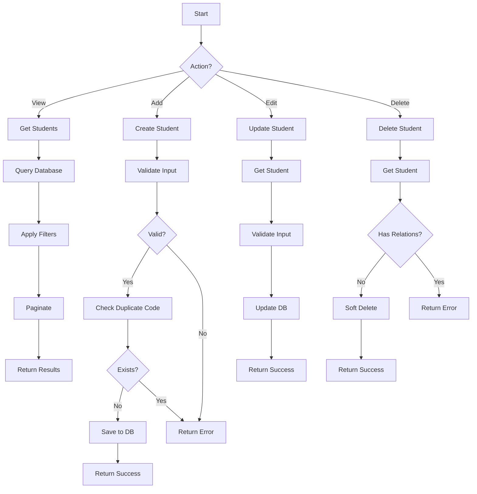

# Module 01: Student Management

## Overview

Quản lý thông tin sinh viên trong hệ thống, bao gồm hồ sơ cá nhân, lớp học, và trạng thái học tập.

## Actors

| Actor | Description |
|-------|-------------|
| **Nhân viên giáo vụ** | Quản lý thông tin sinh viên (CRUD) |
| **Sinh viên** | Xem thông tin cá nhân (read-only) |

## Use Cases

### UC-01.1: Xem danh sách sinh viên

**Preconditions:**
- User đăng nhập với quyền "Nhân viên giáo vụ" hoặc "Admin"

**Main Flow:**
1. User truy cập trang quản lý sinh viên
2. System hiển thị danh sách sinh viên (phân trang)
3. User có thể tìm kiếm theo:
   - Mã sinh viên
   - Họ và tên
   - Email
   - Số điện thoại

**Postconditions:**
- Danh sách sinh viên được hiển thị

**Business Rules:**
- Phân trang: 10 sinh viên/trang
- Sort mặc định: Theo mã sinh viên (tăng dần)

---

### UC-01.2: Xem chi tiết sinh viên

**Preconditions:**
- User có quyền xem thông tin sinh viên

**Main Flow:**
1. User click vào sinh viên trong danh sách
2. System hiển thị thông tin chi tiết:
   - Thông tin cá nhân
   - Thông tin liên hệ
   - Lớp học
   - Trạng thái

**Postconditions:**
- Thông tin sinh viên được hiển thị đầy đủ

---

### UC-01.3: Thêm sinh viên mới

**Preconditions:**
- User có quyền "Nhân viên giáo vụ" hoặc "Admin"

**Main Flow:**
1. User click nút "Thêm sinh viên"
2. System hiển thị form nhập thông tin
3. User nhập thông tin:
   - Mã sinh viên (bắt buộc)
   - Họ và tên (bắt buộc)
   - Ngày sinh (bắt buộc)
   - Giới tính (bắt buộc)
   - Email (bắt buộc)
   - Số điện thoại (bắt buộc)
   - Địa chỉ (tùy chọn)
   - Lớp (bắt buộc)
   - Trạng thái (bắt buộc)
4. User click "Lưu"
5. System kiểm tra dữ liệu:
   - Mã sinh viên không được trùng
   - Email hợp lệ
   - Các trường bắt buộc đã điền
6. System lưu thông tin vào database
7. System hiển thị thông báo thành công

**Postconditions:**
- Sinh viên mới được thêm vào hệ thống

**Business Rules:**
- Mã sinh viên phải là duy nhất
- Email phải hợp lệ (có @)
- Ngày sinh không được là tương lai
- Trạng thái mặc định: "Active" (Đang học)

**Validation Rules:**
| Field | Type | Rule |
|-------|------|------|
| StudentCode | string | Required, Max 20 chars, Unique |
| FullName | string | Required, Max 100 chars |
| DateOfBirth | date | Required, Not in future |
| Gender | string | Required, Enum: Nam/Nữ/Khác |
| Email | string | Required, Valid email format, Max 100 chars |
| PhoneNumber | string | Required, Max 20 chars |
| Address | string | Optional, Max 200 chars |
| ClassId | int | Required, Must exist in Classes table |
| Status | string | Required, Enum: Active/Inactive/Graduated |

---

### UC-01.4: Cập nhật thông tin sinh viên

**Preconditions:**
- User có quyền "Nhân viên giáo vụ" hoặc "Admin"
- Sinh viên tồn tại trong hệ thống

**Main Flow:**
1. User chọn sinh viên cần sửa
2. User click nút "Sửa"
3. System hiển thị form với thông tin hiện tại
4. User thay đổi thông tin
5. User click "Lưu"
6. System kiểm tra dữ liệu (như UC-01.3)
7. System cập nhật thông tin
8. System hiển thị thông báo thành công

**Postconditions:**
- Thông tin sinh viên được cập nhật

**Business Rules:**
- Không được thay đổi mã sinh viên
- Email mới không được trùng với sinh viên khác
- UpdatedAt được cập nhật tự động

---

### UC-01.5: Xóa sinh viên

**Preconditions:**
- User có quyền "Nhân viên giáo vụ" hoặc "Admin"
- Sinh viên tồn tại trong hệ thống
- Sinh viên không có điểm thi hoặc lịch thi liên quan

**Main Flow:**
1. User chọn sinh viên cần xóa
2. User click nút "Xóa"
3. System hiển thị popup xác nhận
4. User xác nhận xóa
5. System kiểm tra ràng buộc:
   - Không có điểm thi
   - Không có lịch thi
   - Không có điểm danh
6. System xóa sinh viên (soft delete)
7. System hiển thị thông báo thành công

**Postconditions:**
- Sinh viên được đánh dấu là đã xóa

**Business Rules:**
- Soft delete (Status = 'Inactive')
- Không xóa vật lý để bảo toàn dữ liệu lịch sử
- Không được xóa nếu có dữ liệu liên quan

---

## Data Model

### Student Entity

```
Student
├── Id: int (PK, Identity)
├── StudentCode: string (20, Unique, Not Null)
├── FullName: string (100, Not Null)
├── DateOfBirth: DateTime (Not Null)
├── Gender: string (20, Not Null)
├── Email: string (100, Not Null)
├── PhoneNumber: string (20, Not Null)
├── Address: string (200, Null)
├── ClassId: int (FK → Class.Id, Not Null)
├── Status: string (20, Default 'Active')
├── CreatedAt: DateTime (Default GETDATE())
└── UpdatedAt: DateTime? (Null)
```

### Related Entities

```
Class
├── Id: int (PK)
└── ClassName: string

Attendance
├── Id: int (PK)
└── StudentId: int (FK → Student.Id)

Grade
├── Id: int (PK)
└── StudentId: int (FK → Student.Id)
```

---

## API Endpoints

| Method | Endpoint | Description | Auth Required |
|--------|----------|-------------|---------------|
| GET | /api/students | Get all students (paged) | Yes |
| GET | /api/students/{id} | Get student by ID | Yes |
| POST | /api/students | Create new student | Yes (Admin/Staff) |
| PUT | /api/students/{id} | Update student | Yes (Admin/Staff) |
| DELETE | /api/students/{id} | Delete student | Yes (Admin/Staff) |

### Request/Response Examples

#### GET /api/students?page=1&pageSize=10&searchTerm=SV001

**Response 200 OK:**
```json
{
  "success": true,
  "message": "Lấy danh sách sinh viên thành công",
  "data": [
    {
      "id": 1,
      "studentCode": "SV001",
      "fullName": "Nguyễn Văn A",
      "dateOfBirth": "2000-01-15",
      "gender": "Nam",
      "email": "sv001@e360.edu.vn",
      "phoneNumber": "0901234567",
      "address": "Hà Nội",
      "classId": 1,
      "status": "Active",
      "createdAt": "2024-01-01T00:00:00Z"
    }
  ],
  "pageNumber": 1,
  "pageSize": 10,
  "totalRecords": 100,
  "totalPages": 10
}
```

#### POST /api/students

**Request:**
```json
{
  "studentCode": "SV001",
  "fullName": "Nguyễn Văn A",
  "dateOfBirth": "2000-01-15",
  "gender": "Nam",
  "email": "sv001@e360.edu.vn",
  "phoneNumber": "0901234567",
  "address": "Hà Nội",
  "classId": 1,
  "status": "Active"
}
```

**Response 201 Created:**
```json
{
  "success": true,
  "message": "Thêm sinh viên thành công",
  "data": {
    "id": 1,
    "studentCode": "SV001",
    ...
  }
}
```

---

## UI Components

### Pages

| Page | Route | Description |
|------|-------|-------------|
| Student List | /Students | Danh sách sinh viên (default) |
| Student Detail | /Students/{id} | Chi tiết sinh viên |
| Add Student | /Students/create | Form thêm sinh viên |
| Edit Student | /Students/{id}/edit | Form sửa sinh viên |

### Components

- StudentTable: Bảng danh sách sinh viên
- StudentForm: Form nhập thông tin
- StudentSearch: Thanh tìm kiếm
- Pagination: Phân trang
- StudentStatus: Badge hiển thị trạng thái

---

## Workflows



---

## Testing Scenarios

### Unit Tests

| Test Case | Description | Expected Result |
|-----------|-------------|-----------------|
| TC-001 | Get all students | Returns paginated list |
| TC-002 | Get student by ID (exists) | Returns student |
| TC-003 | Get student by ID (not exists) | Returns 404 |
| TC-004 | Create student (valid) | Returns 201, student saved |
| TC-005 | Create student (duplicate code) | Returns 400 |
| TC-006 | Create student (invalid email) | Returns 400 |
| TC-007 | Update student (valid) | Returns 200, student updated |
| TC-008 | Update student (not exists) | Returns 404 |
| TC-009 | Delete student (no relations) | Returns 200, soft deleted |
| TC-010 | Delete student (has relations) | Returns 400 |

### Integration Tests

| Test Case | Description | Expected Result |
|-----------|-------------|-----------------|
| TC-101 | Search students by name | Returns matching students |
| TC-102 | Search students by code | Returns matching students |
| TC-103 | Pagination (page 2) | Returns correct page |
| TC-104 | Sort by name | Returns sorted list |

---

## Open Issues / TODOs

- [ ] Import sinh viên từ Excel
- [ ] Export danh sách sinh viên ra PDF/Excel
- [ ] Upload ảnh đại diện sinh viên
- [ ] Lịch sử cập nhật thông tin sinh viên
- [ ] Gửi email thông báo cho sinh viên
