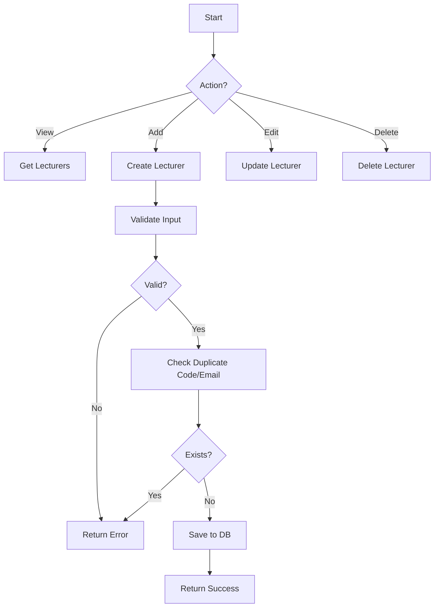

# Module 02: Lecturer Management

## Overview

Quản lý thông tin giảng viên, bao gồm hồ sơ cá nhân, bộ môn, chức vụ và khả năng tham gia coi thi.

## Actors

| Actor | Description |
|-------|-------------|
| **Admin** | Quản lý thông tin giảng viên (CRUD) |
| **Nhân viên giáo vụ** | Xem danh sách giảng viên để phân công |
| **Giảng viên** | Xem thông tin cá nhân (read-only) |

## Use Cases

### UC-02.1: Xem danh sách giảng viên

**Preconditions:**
- User đăng nhập với quyền Admin, Nhân viên giáo vụ, hoặc Giảng viên

**Main Flow:**
1. User truy cập trang quản lý giảng viên
2. System hiển thị danh sách giảng viên (phân trang)
3. User có thể tìm kiếm theo:
   - Mã giảng viên
   - Họ và tên
   - Bộ môn
   - Email

**Postconditions:**
- Danh sách giảng viên được hiển thị

**Business Rules:**
- Phân trang: 10 giảng viên/trang
- Sort mặc định: Theo mã giảng viên

---

### UC-02.2: Xem chi tiết giảng viên

**Preconditions:**
- User có quyền xem thông tin giảng viên

**Main Flow:**
1. User click vào giảng viên trong danh sách
2. System hiển thị thông tin chi tiết:
   - Thông tin cá nhân
   - Thông tin liên hệ
   - Bộ môn
   - Chức vụ
   - Trạng thái

**Postconditions:**
- Thông tin giảng viên được hiển thị đầy đủ

---

### UC-02.3: Thêm giảng viên mới

**Preconditions:**
- User có quyền Admin

**Main Flow:**
1. User click nút "Thêm giảng viên"
2. System hiển thị form nhập thông tin
3. User nhập thông tin:
   - Mã giảng viên (bắt buộc)
   - Họ và tên (bắt buộc)
   - Ngày sinh (bắt buộc)
   - Giới tính (bắt buộc)
   - Email (bắt buộc)
   - Số điện thoại (bắt buộc)
   - Bộ môn (bắt buộc)
   - Chức vụ (tùy chọn)
   - Trạng thái (bắt buộc)
4. User click "Lưu"
5. System kiểm tra dữ liệu:
   - Mã giảng viên không được trùng
   - Email hợp lệ
   - Các trường bắt buộc đã điền
6. System lưu thông tin vào database
7. System hiển thị thông báo thành công

**Postconditions:**
- Giảng viên mới được thêm vào hệ thống

**Business Rules:**
- Mã giảng viên phải là duy nhất
- Email phải hợp lệ
- Trạng thái mặc định: "Active"

**Validation Rules:**
| Field | Type | Rule |
|-------|------|------|
| EmployeeCode | string | Required, Max 20 chars, Unique |
| FullName | string | Required, Max 100 chars |
| DateOfBirth | date | Required, Not in future |
| Gender | string | Required, Enum: Nam/Nữ/Khác |
| Email | string | Required, Valid email, Max 100 chars, Unique |
| PhoneNumber | string | Required, Max 20 chars |
| Department | string | Required, Max 100 chars |
| Position | string | Optional, Max 50 chars |
| Status | string | Required, Enum: Active/Inactive |

---

### UC-02.4: Cập nhật thông tin giảng viên

**Preconditions:**
- User có quyền Admin
- Giảng viên tồn tại trong hệ thống

**Main Flow:**
1. User chọn giảng viên cần sửa
2. User click nút "Sửa"
3. System hiển thị form với thông tin hiện tại
4. User thay đổi thông tin
5. User click "Lưu"
6. System kiểm tra dữ liệu
7. System cập nhật thông tin
8. System hiển thị thông báo thành công

**Postconditions:**
- Thông tin giảng viên được cập nhật

**Business Rules:**
- Không được thay đổi mã giảng viên
- Email mới không được trùng với giảng viên khác

---

### UC-02.5: Xóa giảng viên

**Preconditions:**
- User có quyền Admin
- Giảng viên tồn tại trong hệ thống
- Giảng viên không có lịch coi thi hoặc điểm thi liên quan

**Main Flow:**
1. User chọn giảng viên cần xóa
2. User click nút "Xóa"
3. System hiển thị popup xác nhận
4. User xác nhận xóa
5. System kiểm tra ràng buộc:
   - Không có lịch coi thi trong tương lai
   - Không có điểm thi chưa duyệt
6. System xóa giảng viên (soft delete)
7. System hiển thị thông báo thành công

**Postconditions:**
- Giảng viên được đánh dấu là đã xóa

**Business Rules:**
- Soft delete (Status = 'Inactive')
- Không xóa vật lý để bảo toàn dữ liệu lịch sử

---

## Data Model

### Lecturer Entity

```
Lecturer
├── Id: int (PK, Identity)
├── EmployeeCode: string (20, Unique, Not Null)
├── FullName: string (100, Not Null)
├── DateOfBirth: DateTime (Not Null)
├── Gender: string (20, Not Null)
├── Email: string (100, Unique, Not Null)
├── PhoneNumber: string (20, Not Null)
├── Department: string (100, Not Null)
├── Position: string (50, Null)
├── Status: string (20, Default 'Active')
├── CreatedAt: DateTime (Default GETDATE())
└── UpdatedAt: DateTime? (Null)
```

### Related Entities

```
ProctorAssignment
├── Id: int (PK)
└── LecturerId: int (FK → Lecturer.Id)

Grade
├── Id: int (PK)
└── EnteredBy: int? (FK → Lecturer.Id)
```

---

## API Endpoints

| Method | Endpoint | Description | Auth Required |
|--------|----------|-------------|---------------|
| GET | /api/lecturers | Get all lecturers (paged) | Yes |
| GET | /api/lecturers/{id} | Get lecturer by ID | Yes |
| POST | /api/lecturers | Create new lecturer | Yes (Admin) |
| PUT | /api/lecturers/{id} | Update lecturer | Yes (Admin) |
| DELETE | /api/lecturers/{id} | Delete lecturer | Yes (Admin) |
| GET | /api/lecturers/available | Get available lecturers | Yes |

---

## UI Components

### Pages

| Page | Route | Description |
|------|-------|-------------|
| Lecturer List | /Lecturers | Danh sách giảng viên |
| Lecturer Detail | /Lecturers/{id} | Chi tiết giảng viên |
| Add Lecturer | /Lecturers/create | Form thêm giảng viên |
| Edit Lecturer | /Lecturers/{id}/edit | Form sửa giảng viên |

---

## Workflows



---

## Testing Scenarios

| Test Case | Description | Expected Result |
|-----------|-------------|-----------------|
| TC-001 | Get all lecturers | Returns paginated list |
| TC-002 | Get lecturer by ID (exists) | Returns lecturer |
| TC-003 | Get lecturer by ID (not exists) | Returns 404 |
| TC-004 | Create lecturer (valid) | Returns 201 |
| TC-005 | Create lecturer (duplicate code) | Returns 400 |
| TC-006 | Create lecturer (duplicate email) | Returns 400 |
| TC-007 | Update lecturer (valid) | Returns 200 |
| TC-008 | Delete lecturer (has relations) | Returns 400 |

---

## Open Issues / TODOs

- [ ] Import giảng viên từ Excel
- [ ] Upload ảnh đại diện
- [ ] Quản lý lịch sử công tác
- [ ] Đánh giá giảng viên coi thi
