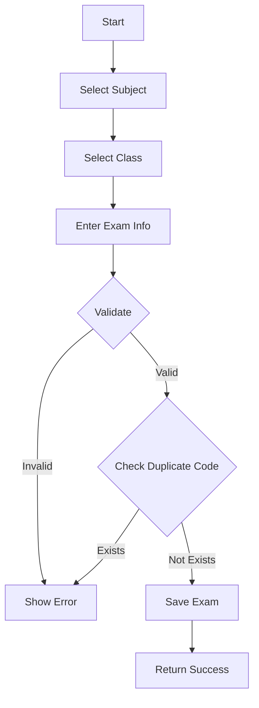
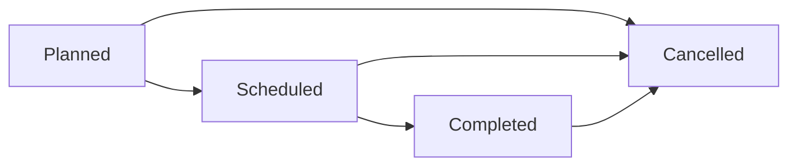

# Module 03: Exam Management

## Overview

Quản lý thông tin môn thi, đề thi, bao gồm các kỳ thi lớp học và thi tốt nghiệp.

## Actors

| Actor | Description |
|-------|-------------|
| **Admin** | Quản lý môn thi (CRUD) |
| **Nhân viên giáo vụ** | Tạo môn thi, xem danh sách môn thi |
| **Giảng viên** | Xem môn thi mình phụ trách |
| **Sinh viên** | Xem môn thi cần tham dự |

## Use Cases

### UC-03.1: Xem danh sách môn thi

**Preconditions:**
- User đăng nhập

**Main Flow:**
1. User truy cập trang quản lý môn thi
2. System hiển thị danh sách môn thi (phân trang)
3. User có thể lọc theo:
   - Loại thi (ClassExam, GraduationExam)
   - Học kỳ
   - Năm học
   - Trạng thái

**Business Rules:**
- Phân trang: 10 môn thi/trang
- Sort theo: Mã môn thi

---

### UC-03.2: Thêm môn thi mới

**Preconditions:**
- User có quyền Admin hoặc Nhân viên giáo vụ

**Main Flow:**
1. User click nút "Thêm môn thi"
2. System hiển thị form nhập thông tin
3. User nhập thông tin:
   - Mã môn thi (bắt buộc)
   - Tên môn thi (bắt buộc)
   - Loại thi (bắt buộc)
   - Tín chỉ (bắt buộc)
   - Số tiết lý thuyết (bắt buộc)
   - Số tiết thực hành (bắt buộc)
   - Bộ môn (tùy chọn)
   - Loại môn (Core, Elective, General)
4. User click "Lưu"
5. System kiểm tra và lưu

**Validation Rules:**
| Field | Type | Rule |
|-------|------|------|
| SubjectCode | string | Required, Max 20, Unique |
| SubjectName | string | Required, Max 200 |
| Credits | int | Required, 1-10 |
| TheoryHours | int | Required, >= 0 |
| PracticeHours | int | Required, >= 0 |
| Department | string | Optional, Max 100 |
| SubjectType | string | Required, Core/Elective/General |
| Status | string | Default 'Active' |

---

### UC-03.3: Tạo kỳ thi

**Preconditions:**
- Môn thi tồn tại trong hệ thống
- User có quyền Admin hoặc Nhân viên giáo vụ

**Main Flow:**
1. User click "Tạo kỳ thi"
2. System hiển thị form:
   - Mã kỳ thi (bắt buộc)
   - Tên kỳ thi (bắt buộc)
   - Loại kỳ thi (ClassExam, GraduationExam)
   - Môn thi (bắt buộc)
   - Lớp (bắt buộc)
   - Năm học (bắt buộc)
   - Học kỳ (bắt buộc)
   - Thời lượng (phút) (bắt buộc)
   - Trạng thái (Planned, Scheduled, Completed, Cancelled)
3. User nhập thông tin và lưu
4. System kiểm tra trùng mã kỳ thi
5. System lưu vào database

**Validation Rules:**
| Field | Type | Rule |
|-------|------|------|
| ExamCode | string | Required, Max 20, Unique |
| ExamName | string | Required, Max 200 |
| ExamType | string | Required, ClassExam/GraduationExam |
| SubjectId | int | Required, FK → Subject |
| ClassId | int | Required, FK → Class |
| AcademicYear | string | Required, Format: "2024-2025" |
| Semester | string | Required, Max 20 |
| Duration | int | Required, 60-180 (phút) |
| Status | string | Default 'Planned' |

---

### UC-03.4: Cập nhật môn thi/kỳ thi

**Preconditions:**
- Môn thi/kỳ thi tồn tại
- User có quyền Admin hoặc Nhân viên giáo vụ

**Main Flow:**
1. User chọn môn thi/kỳ thi cần sửa
2. User click "Sửa"
3. System hiển thị form với thông tin hiện tại
4. User thay đổi thông tin
5. System kiểm tra và cập nhật

**Business Rules:**
- Không được sửa mã môn thi/mã kỳ thi
- Chỉ được sửa kỳ thi ở trạng thái "Planned"

---

### UC-03.5: Xóa môn thi/kỳ thi

**Preconditions:**
- Môn thi/kỳ thi tồn tại
- User có quyền Admin
- Không có lịch thi hoặc điểm thi liên quan

**Main Flow:**
1. User chọn môn thi/kỳ thi cần xóa
2. User click "Xóa"
3. System xác nhận
4. System kiểm tra ràng buộc
5. System xóa (soft delete)

**Business Rules:**
- Soft delete (Status = 'Inactive')
- Không được xóa nếu có lịch thi đã lên

---

## Data Model

### Subject Entity

```
Subject
├── Id: int (PK, Identity)
├── SubjectCode: string (20, Unique, Not Null)
├── SubjectName: string (200, Not Null)
├── Credits: int (Not Null)
├── TheoryHours: int (Not Null)
├── PracticeHours: int (Not Null)
├── Department: string (100, Null)
├── SubjectType: string (50, Default 'Core')
├── Status: string (20, Default 'Active')
├── CreatedAt: DateTime (Default GETDATE())
└── UpdatedAt: DateTime? (Null)
```

### Exam Entity

```
Exam
├── Id: int (PK, Identity)
├── ExamCode: string (20, Unique, Not Null)
├── ExamName: string (200, Not Null)
├── ExamType: string (50, Not Null)
├── SubjectId: int (FK → Subject.Id, Not Null)
├── ClassId: int (FK → Class.Id, Not Null)
├── ExamDate: DateTime (Null)
├── StartTime: TimeSpan (Null)
├── EndTime: TimeSpan (Null)
├── Duration: int (Not Null)
├── RoomId: int (FK → ExamRoom.Id, Null)
├── AcademicYear: string (20, Not Null)
├── Semester: string (20, Not Null)
├── Status: string (20, Default 'Planned')
├── CreatedAt: DateTime (Default GETDATE())
└── UpdatedAt: DateTime? (Null)
```

---

## API Endpoints

### Subject Endpoints

| Method | Endpoint | Description | Auth Required |
|--------|----------|-------------|---------------|
| GET | /api/subjects | Get all subjects | Yes |
| GET | /api/subjects/{id} | Get subject by ID | Yes |
| POST | /api/subjects | Create subject | Yes (Admin) |
| PUT | /api/subjects/{id} | Update subject | Yes (Admin) |
| DELETE | /api/subjects/{id} | Delete subject | Yes (Admin) |

### Exam Endpoints

| Method | Endpoint | Description | Auth Required |
|--------|----------|-------------|---------------|
| GET | /api/exams | Get all exams (paged, filtered) | Yes |
| GET | /api/exams/{id} | Get exam by ID | Yes |
| POST | /api/exams | Create exam | Yes (Admin/Staff) |
| PUT | /api/exams/{id} | Update exam | Yes (Admin/Staff) |
| DELETE | /api/exams/{id} | Delete exam | Yes (Admin) |
| GET | /api/exams/by-class/{classId} | Get exams by class | Yes |
| GET | /api/exams/by-subject/{subjectId} | Get exams by subject | Yes |

---

## Workflows

### Create Exam Workflow



### Exam Status Flow



---

## Business Rules

1. **Mã môn thi/mã kỳ thi**: Phải là duy nhất trong toàn hệ thống
2. **Loại kỳ thi**: 
   - ClassExam: Thi kết thúc học phần
   - GraduationExam: Thi tốt nghiệp
3. **Thời lượng thi**: 
   - Tối thiểu: 60 phút
   - Tối đa: 180 phút
4. **Trạng thái**:
   - Planned: Đã lên kế hoạch, chưa có lịch
   - Scheduled: Đã có lịch thi cụ thể
   - Completed: Đã hoàn thành
   - Cancelled: Đã hủy
5. **Ràng buộc thời gian**:
   - Chỉ được sửa/xóa khi ở trạng thái "Planned"
   - Khi có lịch thi (Scheduled), không được sửa thông tin cơ bản

---

## Testing Scenarios

| Test Case | Description | Expected Result |
|-----------|-------------|-----------------|
| TC-001 | Create subject (valid) | Returns 201 |
| TC-002 | Create subject (duplicate code) | Returns 400 |
| TC-003 | Create exam (valid) | Returns 201 |
| TC-004 | Create exam (duplicate code) | Returns 400 |
| TC-005 | Update exam (Scheduled status) | Returns 400 |
| TC-006 | Delete exam (has schedule) | Returns 400 |
| TC-007 | Get exams by class | Returns filtered list |
| TC-008 | Get exams by subject | Returns filtered list |

---

## Open Issues / TODOs

- [ ] Import môn thi từ Excel
- [ ] Export danh sách môn thi
- [ ] Quản lý đề thi (ngân hàng câu hỏi)
- [ ] Phân quyền theo bộ môn
- [ ] Lịch sử thay đổi môn thi
