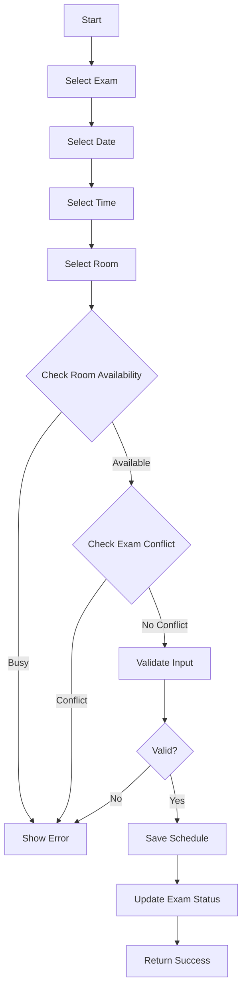
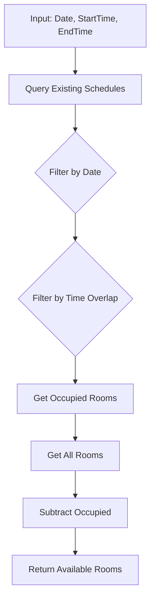

# Module 04: Exam Schedule

## Overview

Lập lịch thi chi tiết cho các môn thi, bao gồm phân bổ thời gian, địa điểm, và phòng thi.

## Actors

| Actor | Description |
|-------|-------------|
| **Nhân viên giáo vụ** | Lập lịch thi, điều chỉnh lịch |
| **Giảng viên** | Xem lịch thi môn mình phụ trách |
| **Sinh viên** | Xem lịch thi cá nhân |

## Use Cases

### UC-04.1: Xem danh sách lịch thi

**Preconditions:**
- User đăng nhập

**Main Flow:**
1. User truy cập trang lịch thi
2. System hiển thị danh sách lịch thi (phân trang)
3. User có thể lọc theo:
   - Ngày thi
   - Môn thi
   - Lớp
   - Phòng thi
   - Trạng thái

---

### UC-04.2: Tạo lịch thi cho môn thi

**Preconditions:**
- Môn thi tồn tại và ở trạng thái "Planned"
- User có quyền "Nhân viên giáo vụ"

**Main Flow:**
1. User chọn môn thi cần lập lịch
2. User click "Tạo lịch thi"
3. System hiển thị form:
   - Ngày thi (bắt buộc)
   - Giờ bắt đầu (bắt buộc)
   - Giờ kết thúc (tự động tính từ duration)
   - Phòng thi (bắt buộc)
   - Ghi chú (tùy chọn)
4. System kiểm tra:
   - Phòng thi chưa được đặt vào giờ này
   - Không trùng lịch với lớp học khác
5. User nhập thông tin và lưu
6. System cập nhật trạng thái môn thi thành "Scheduled"

**Validation Rules:**
| Field | Type | Rule |
|-------|------|------|
| ExamId | int | Required, FK → Exam |
| Date | DateTime | Required, Not in past |
| StartTime | TimeSpan | Required |
| EndTime | TimeSpan | Required, > StartTime |
| RoomId | int | Required, FK → ExamRoom |
| Status | string | Default 'Scheduled' |
| Notes | string | Optional, Max 500 |

**Business Rules:**
- Giờ bắt đầu không được trước thời gian hiện tại
- Phòng thi phải có sức chứa >= số lượng sinh viên
- Không được trùng lịch với phòng thi khác trong cùng khung giờ
- Thời lượng = EndTime - StartTime (phải khớp với duration của môn thi)

---

### UC-04.3: Kiểm tra phòng thi trống

**Preconditions:**
- User có quyền "Nhân viên giáo vụ"

**Main Flow:**
1. User nhập ngày thi, giờ thi
2. System kiểm tra các phòng thi đã được đặt
3. System hiển thị danh sách phòng thi trống
4. User chọn phòng thi phù hợp

**Business Rules:**
- Kiểm tra tất cả lịch thi đã có trong khoảng thời gian
- Loại trừ các phòng đang bảo trì (Status = 'Maintenance')

---

### UC-04.4: Cập nhật lịch thi

**Preconditions:**
- Lịch thi tồn tại
- User có quyền "Nhân viên giáo vụ"
- Lịch thi chưa diễn ra (ngày thi > hiện tại)

**Main Flow:**
1. User chọn lịch thi cần sửa
2. User click "Sửa"
3. System hiển thị form với thông tin hiện tại
4. User thay đổi thông tin
5. System kiểm tra ràng buộc (như UC-04.2)
6. System cập nhật

**Business Rules:**
- Chỉ được sửa lịch thi chưa diễn ra
- Thông báo cho sinh viên và giảng viên nếu có thay đổi

---

### UC-04.5: Hủy lịch thi

**Preconditions:**
- Lịch thi tồn tại
- User có quyền "Nhân viên giáo vụ"
- Lịch thi chưa diễn ra

**Main Flow:**
1. User chọn lịch thi cần hủy
2. User click "Hủy"
3. System xác nhận
4. System cập nhật trạng thái thành "Cancelled"
5. System cập nhật trạng thái môn thi thành "Planned"
6. System thông báo cho sinh viên và giảng viên

---

### UC-04.6: Xuất danh sách phòng thi

**Preconditions:**
- Lịch thi đã được lên
- User có quyền "Nhân viên giáo vụ"

**Main Flow:**
1. User chọn kỳ thi/khóa thi
2. User click "Xuất danh sách phòng thi"
3. System tạo PDF/Excel với:
   - Danh sách phòng thi
   - Số lượng sinh viên mỗi phòng
   - Giám thị phụ trách
4. User tải xuống hoặc in

---

## Data Model

### ExamSchedule Entity

```
ExamSchedule
├── Id: int (PK, Identity)
├── ExamId: int (FK → Exam.Id, Not Null)
├── Date: DateTime (Not Null)
├── StartTime: TimeSpan (Not Null)
├── EndTime: TimeSpan (Not Null)
├── RoomId: int (FK → ExamRoom.Id, Not Null)
├── Status: string (20, Default 'Scheduled')
├── Notes: string (500, Null)
├── CreatedAt: DateTime (Default GETDATE())
└── UpdatedAt: DateTime? (Null)
```

### ExamRoom Entity

```
ExamRoom
├── Id: int (PK, Identity)
├── RoomCode: string (20, Unique, Not Null)
├── RoomName: string (100, Not Null)
├── Building: string (100, Null)
├── Capacity: int (Not Null)
├── Floor: string (20, Null)
├── HasComputer: bool (Default false)
├── HasProjector: bool (Default false)
├── Status: string (20, Default 'Available')
├── CreatedAt: DateTime (Default GETDATE())
└── UpdatedAt: DateTime? (Null)
```

### Relationships

```
ExamSchedule (1) ──→ (1) Exam
ExamSchedule (1) ──→ (1) ExamRoom
ExamSchedule (1) ──→ (N) ProctorAssignment
ExamSchedule (1) ──→ (N) Attendance
```

---

## API Endpoints

### ExamSchedule Endpoints

| Method | Endpoint | Description | Auth Required |
|--------|----------|-------------|---------------|
| GET | /api/exam-schedules | Get all schedules (filtered) | Yes |
| GET | /api/exam-schedules/{id} | Get schedule by ID | Yes |
| POST | /api/exam-schedules | Create schedule | Yes (Staff) |
| PUT | /api/exam-schedules/{id} | Update schedule | Yes (Staff) |
| DELETE | /api/exam-schedules/{id} | Cancel schedule | Yes (Staff) |
| GET | /api/exam-schedules/by-exam/{examId} | Get schedules by exam | Yes |
| GET | /api/exam-schedules/by-room/{roomId} | Get schedules by room | Yes |
| GET | /api/exam-schedules/available-rooms | Get available rooms | Yes |

### ExamRoom Endpoints

| Method | Endpoint | Description | Auth Required |
|--------|----------|-------------|---------------|
| GET | /api/exam-rooms | Get all exam rooms | Yes |
| GET | /api/exam-rooms/{id} | Get room by ID | Yes |
| POST | /api/exam-rooms | Create room | Yes (Admin) |
| PUT | /api/exam-rooms/{id} | Update room | Yes (Admin) |
| DELETE | /api/exam-rooms/{id} | Delete room | Yes (Admin) |
| GET | /api/exam-rooms/available | Get available rooms at time | Yes |

---

## Workflows

### Create Exam Schedule Workflow



### Room Availability Check



---

## Business Rules

### Room Scheduling Rules

1. **Không trùng lặp**: Một phòng không được đặt 2 lần trong cùng khung giờ
2. **Sức chứa**: Capacity >= số lượng sinh viên tham dự
3. **Thời gian làm việc**: 
   - Sáng: 7:00 - 12:00
   - Chiều: 13:00 - 18:00
   - Tối: 18:30 - 21:00 (nếu có)
4. **Thời gian đệm**: 15 phút giữa các ca thi để dọn phòng

### Conflict Detection

```
Time Overlap = (Start1 < End2) AND (Start2 < End1)
```

### Status Transitions

```
Scheduled → InProgress → Completed
Scheduled → Cancelled
```

---

## UI Components

### Pages

| Page | Route | Description |
|------|-------|-------------|
| Schedule List | /ExamSchedules | Danh sách lịch thi |
| Schedule Detail | /ExamSchedules/{id} | Chi tiết lịch thi |
| Create Schedule | /ExamSchedules/create | Form tạo lịch thi |
| Edit Schedule | /ExamSchedules/{id}/edit | Form sửa lịch thi |
| Room Management | /ExamRooms | Quản lý phòng thi |
| Calendar View | /ExamSchedules/calendar | Lịch thi dạng calendar |

### Components

- ScheduleCalendar: Hiển thị lịch thi dạng tháng/tuần
- RoomSelector: Dropdown chọn phòng thi (có check availability)
- TimeSlotPicker: Chọn khung giờ thi
- ConflictWarning: Cảnh báo trùng lịch
- ScheduleExport: Xuất lịch thi ra PDF/Excel

---

## Testing Scenarios

| Test Case | Description | Expected Result |
|-----------|-------------|-----------------|
| TC-001 | Create schedule (valid) | Returns 201 |
| TC-002 | Create schedule (room busy) | Returns 400 |
| TC-003 | Create schedule (time conflict) | Returns 400 |
| TC-004 | Update schedule (past date) | Returns 400 |
| TC-005 | Cancel schedule (future) | Returns 200 |
| TC-006 | Get available rooms | Returns available list |
| TC-007 | Get schedules by exam | Returns filtered list |
| TC-008 | Get schedules by room | Returns filtered list |

---

## Open Issues / TODOs

- [ ] Calendar view drag-and-drop để điều chỉnh lịch
- [ ] Tự động đề xuất phòng thi khi tạo lịch
- [ ] Gửi email thông báo lịch thi
- [ ] Xuất lịch thi ra PDF với template đẹp
- [ ] Check conflict với lịch học của giảng viên
- [ ] Hỗ trợ ca thi (Sáng/Chiều/Tối)
