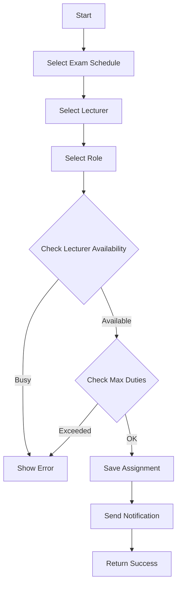
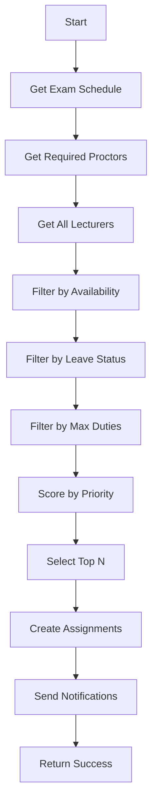
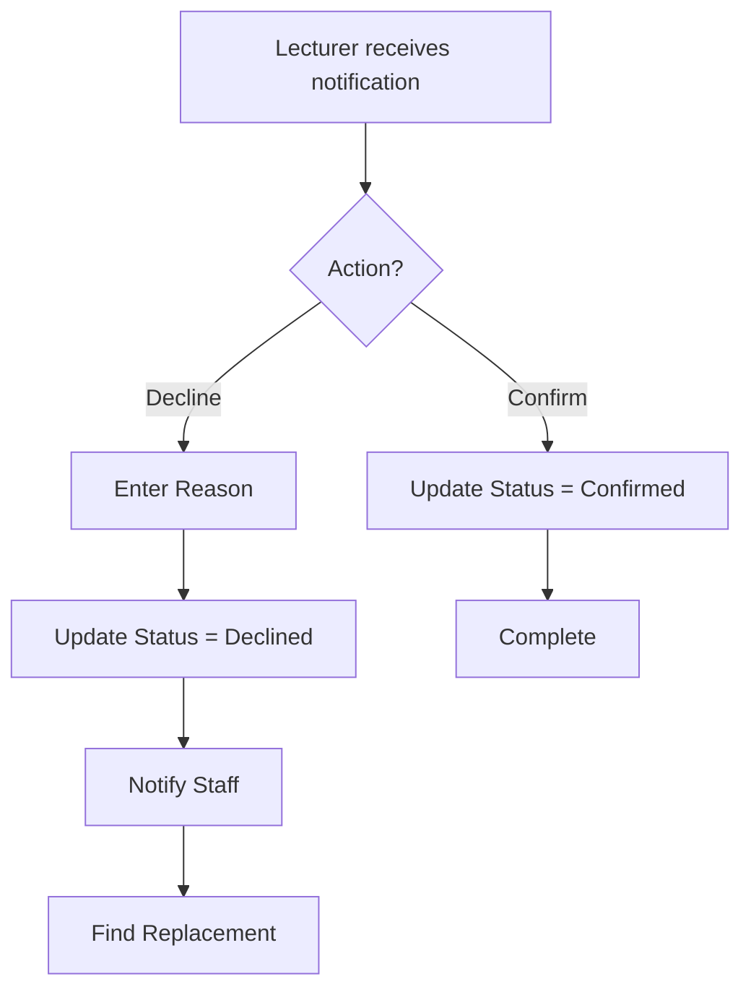

# Module 05: Proctor Assignment

## Overview

Phân công giảng viên coi thi cho các ca thi, quản lý lịch coi thi và theo dõi việc phân công.

## Actors

| Actor | Description |
|-------|-------------|
| **Nhân viên giáo vụ** | Phân công giám thị, xem báo cáo |
| **Giảng viên** | Xem lịch coi thi, xác nhận/từ chối |

## Use Cases

### UC-05.1: Xem danh sách phân công coi thi

**Preconditions:**
- User đăng nhập

**Main Flow:**
1. User truy cập trang phân công coi thi
2. System hiển thị danh sách phân công (phân trang)
3. User có thể lọc theo:
   - Ngày thi
   - Giảng viên
   - Phòng thi
   - Vai trò (Chief Proctor, Proctor)
   - Trạng thái

---

### UC-05.2: Phân công giám thị cho ca thi

**Preconditions:**
- Lịch thi tồn tại
- User có quyền "Nhân viên giáo vụ"

**Main Flow:**
1. User chọn ca thi cần phân công
2. User click "Phân công giám thị"
3. System hiển thị form:
   - Chọn giảng viên (bắt buộc)
   - Vai trò (bắt buộc): Chief Proctor hoặc Proctor
   - Ghi chú (tùy chọn)
4. System kiểm tra:
   - Giảng viên chưa được phân công ca khác cùng giờ
   - Giảng viên khả dụng (không nghỉ phép)
5. User lưu phân công
6. System gửi thông báo cho giảng viên

**Validation Rules:**
| Field | Type | Rule |
|-------|------|------|
| ExamScheduleId | int | Required, FK → ExamSchedule |
| LecturerId | int | Required, FK → Lecturer |
| Role | string | Required, ChiefProctor/Proctor |
| Status | string | Default 'Assigned' |
| Notes | string | Optional, Max 500 |

**Business Rules:**
- Mỗi ca thi cần ít nhất 1 Chief Proctor
- Mỗi ca thi cần tối thiểu 2 giám thị
- Một giảng viên không được coi 2 ca cùng giờ
- Số ca coi thi tối đa/ngày: 2

---

### UC-05.3: Tự động phân công giám thị

**Preconditions:**
- Lịch thi tồn tại
- User có quyền "Nhân viên giáo vụ"

**Main Flow:**
1. User chọn ca thi
2. User click "Tự động phân công"
3. System tìm giảng viên khả dụng:
   - Không có lịch coi thi trùng giờ
   - Không nghỉ phép
   - Chưa vượt quá số ca tối đa/ngày
4. System hiển thị danh sách đề xuất
5. User xác nhận phân công
6. System lưu và gửi thông báo

**Algorithm:**
```
1. Get all available lecturers at exam time
2. Filter out lecturers on leave
3. Filter out lecturers with max proctoring duties
4. Prioritize by:
   - Department match with exam subject
   - Number of proctoring duties (ascending)
5. Select required number of proctors
```

---

### UC-05.4: Giảng viên xác nhận phân công

**Preconditions:**
- Giảng viên được phân công
- Giảng viên đăng nhập

**Main Flow:**
1. Giảng viên xem thông báo phân công
2. Giảng viên click "Xác nhận" hoặc "Từ chối"
3. Nếu từ chối, nhập lý do
4. System cập nhật trạng thái
5. System thông báo cho nhân viên giáo vụ

**Business Rules:**
- Trạng thái: Assigned → Confirmed hoặc Declined
- Nếu từ chối, cần tìm người thay thế

---

### UC-05.5: Điều chỉnh phân công

**Preconditions:**
- Phân công tồn tại
- User có quyền "Nhân viên giáo vụ"
- Ca thi chưa diễn ra

**Main Flow:**
1. User chọn phân công cần điều chỉnh
2. User click "Điều chỉnh"
3. User thay đổi giảng viên hoặc vai trò
4. System kiểm tra ràng buộc
5. System cập nhật
6. System thông báo cho giảng viên mới/cũ

---

### UC-05.6: Xem báo cáo phân công

**Preconditions:**
- User có quyền "Nhân viên giáo vụ"

**Main Flow:**
1. User chọn khoảng thời gian báo cáo
2. System hiển thị:
   - Tổng số ca thi
   - Tổng số lượt phân công
   - Số ca/giảng viên
   - Trạng thái xác nhận
3. User có thể xuất báo cáo

---

## Data Model

### ProctorAssignment Entity

```
ProctorAssignment
├── Id: int (PK, Identity)
├── ExamScheduleId: int (FK → ExamSchedule.Id, Not Null)
├── LecturerId: int (FK → Lecturer.Id, Not Null)
├── Role: string (50, Not Null)
├── AssignedAt: DateTime (Default GETDATE())
├── Status: string (20, Default 'Assigned')
├── Notes: string (500, Null)
└── DeclineReason: string (500, Null)
```

### Enum Values

```
Role:
  - ChiefProctor: Giám thị chính
  - Proctor: Giám thị

Status:
  - Assigned: Đã phân công
  - Confirmed: Đã xác nhận
  - Declined: Đã từ chối
  - Completed: Đã hoàn thành
```

### Relationships

```
ProctorAssignment (N) ──→ (1) ExamSchedule
ProctorAssignment (N) ──→ (1) Lecturer
```

---

## API Endpoints

| Method | Endpoint | Description | Auth Required |
|--------|----------|-------------|---------------|
| GET | /api/proctor-assignments | Get all assignments | Yes |
| GET | /api/proctor-assignments/{id} | Get assignment by ID | Yes |
| POST | /api/proctor-assignments | Create assignment | Yes (Staff) |
| PUT | /api/proctor-assignments/{id} | Update assignment | Yes (Staff) |
| DELETE | /api/proctor-assignments/{id} | Delete assignment | Yes (Staff) |
| GET | /api/proctor-assignments/by-schedule/{scheduleId} | Get by schedule | Yes |
| GET | /api/proctor-assignments/by-lecturer/{lecturerId} | Get by lecturer | Yes |
| POST | /api/proctor-assignments/auto-assign | Auto-assign proctors | Yes (Staff) |
| PUT | /api/proctor-assignments/{id}/confirm | Confirm assignment | Yes (Lecturer) |
| PUT | /api/proctor-assignments/{id}/decline | Decline assignment | Yes (Lecturer) |

---

## Workflows

### Manual Proctor Assignment Workflow



### Auto-Assign Algorithm



### Confirmation Workflow



---

## Business Rules

### Assignment Rules

1. **Số lượng giám thị**:
   - Tối thiểu: 2 giám thị/ca thi
   - Bắt buộc: 1 Chief Proctor

2. **Giới hạn coi thi**:
   - Tối đa: 2 ca/ngày/giảng viên
   - Không coi 2 ca cùng giờ

3. **Ưu tiên phân công**:
   - Giảng viên cùng bộ môn với môn thi
   - Giảng viên có ít ca coi thi nhất
   - Luân phiên công bằng

4. **Trạng thái**:
   - Assigned → Confirmed: Giảng viên xác nhận
   - Assigned → Declined: Giảng viên từ chối
   - Confirmed → Completed: Sau khi thi xong

### Notification Rules

| Event | Recipients | Channel |
|-------|------------|---------|
| New Assignment | Lecturer | Email + In-app |
| Assignment Confirmed | Staff | In-app |
| Assignment Declined | Staff | Email + In-app |
| Schedule Changed | Assigned Lecturers | Email |

---

## UI Components

### Pages

| Page | Route | Description |
|------|-------|-------------|
| Assignment List | /ProctorAssignments | Danh sách phân công |
| Assignment Detail | /ProctorAssignments/{id} | Chi tiết phân công |
| Create Assignment | /ProctorAssignments/create | Form phân công |
| My Proctoring Schedule | /MyProctoring | Lịch coi thi của tôi |
| Proctoring Report | /Reports/Proctoring | Báo cáo phân công |

### Components

- ProctorSelector: Dropdown chọn giảng viên (có check availability)
- RoleSelector: Radio button chọn vai trò
- AssignmentCalendar: Lịch coi thi dạng tháng/tuần
- ConfirmationButtons: Nút xác nhận/từ chối
- ProctoringStats: Thống kê số ca coi thi

---

## Testing Scenarios

| Test Case | Description | Expected Result |
|-----------|-------------|-----------------|
| TC-001 | Create assignment (valid) | Returns 201 |
| TC-002 | Create assignment (lecturer busy) | Returns 400 |
| TC-003 | Create assignment (max duties exceeded) | Returns 400 |
| TC-004 | Auto-assign proctors | Returns assigned list |
| TC-005 | Confirm assignment | Returns 200, status = Confirmed |
| TC-006 | Decline assignment | Returns 200, status = Declined |
| TC-007 | Get assignments by lecturer | Returns filtered list |
| TC-008 | Get assignments by schedule | Returns filtered list |

---

## Open Issues / TODOs

- [ ] Tự động tìm người thay thế khi có người từ chối
- [ ] Tính năng swap (đổi ca) giữa các giảng viên
- [ ] Export danh sách phân công ra PDF
- [ ] Điểm danh giám thị coi thi
- [ ] Đánh giá giảng viên coi thi
- [ ] Thống kê số ca coi thi/giảng viên
- [ ] Lịch sử phân công coi thi
