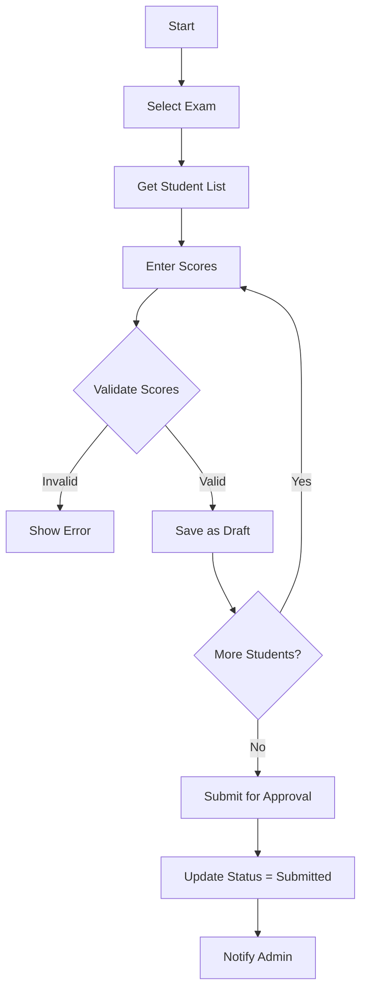
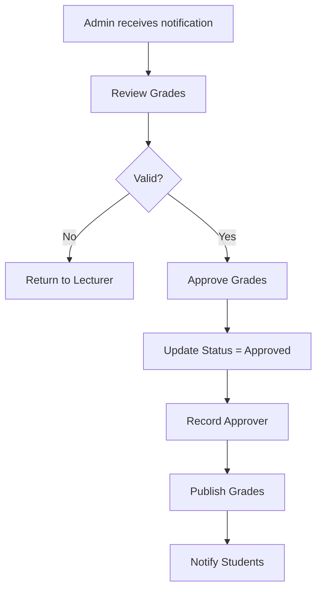

# Module 06: Grade Management

## Overview

Quản lý điểm thi của sinh viên, bao gồm nhập điểm, duyệt điểm, và công bố điểm.

## Actors

| Actor | Description |
|-------|-------------|
| **Giảng viên** | Nhập điểm, cập nhật điểm |
| **Admin/Nhân viên giáo vụ** | Duyệt điểm, công bố điểm |
| **Sinh viên** | Xem điểm thi |

## Use Cases

### UC-06.1: Xem danh sách điểm thi

**Preconditions:**
- User đăng nhập

**Main Flow:**
1. User truy cập trang quản lý điểm
2. System hiển thị danh sách điểm thi (phân trang)
3. User có thể lọc theo:
   - Môn thi
   - Lớp
   - Học kỳ
   - Năm học
   - Trạng thái

**Business Rules:**
- Giảng viên chỉ xem được điểm môn mình dạy
- Sinh viên chỉ xem được điểm cá nhân

---

### UC-06.2: Nhập điểm thi

**Preconditions:**
- Ca thi đã hoàn thành (Status = Completed)
- User là giảng viên phụ trách môn thi
- User có quyền "Giảng viên"

**Main Flow:**
1. User chọn môn thi/ca thi
2. User click "Nhập điểm"
3. System hiển thị danh sách sinh viên dự thi
4. User nhập điểm cho từng sinh viên:
   - Điểm số (0-10)
   - Điểm chữ (A, B, C, D, F)
   - Ghi chú (tùy chọn)
5. User click "Lưu"
6. System kiểm tra dữ liệu
7. System lưu điểm với trạng thái "Draft"

**Validation Rules:**
| Field | Type | Rule |
|-------|------|------|
| StudentId | int | Required, FK → Student |
| ExamId | int | Required, FK → Exam |
| Score | decimal | Required, 0-10, 1 decimal |
| LetterGrade | string | Required, A/B/C/D/F |
| ScoreType | string | Required, Midterm/Final/Other |
| Notes | string | Optional, Max 500 |
| Status | string | Default 'Draft' |

**Grade Scale:**
| Score Range | Letter Grade |
|-------------|--------------|
| 8.5 - 10.0 | A |
| 7.0 - 8.4 | B |
| 5.5 - 6.9 | C |
| 4.0 - 5.4 | D |
| 0.0 - 3.9 | F |

---

### UC-06.3: Cập nhật điểm

**Preconditions:**
- Điểm tồn tại
- User là giảng viên phụ trách
- Điểm chưa được duyệt (Status = Draft hoặc Submitted)

**Main Flow:**
1. User chọn điểm cần sửa
2. User click "Sửa"
3. System hiển thị form với thông tin hiện tại
4. User thay đổi điểm
5. System kiểm tra
6. System cập nhật

**Business Rules:**
- Chỉ được sửa khi chưa duyệt
- Lưu lịch sử thay đổi điểm

---

### UC-06.4: Submit điểm để duyệt

**Preconditions:**
- Giảng viên đã nhập đủ điểm cho tất cả sinh viên
- User là giảng viên phụ trách

**Main Flow:**
1. User chọn môn thi/ca thi
2. User click "Submit để duyệt"
3. System kiểm tra:
   - Tất cả sinh viên đã có điểm
   - Không có điểm null
4. System cập nhật trạng thái tất cả điểm thành "Submitted"
5. System thông báo cho Admin/Nhân viên giáo vụ

---

### UC-06.5: Duyệt điểm

**Preconditions:**
- Điểm ở trạng thái "Submitted"
- User có quyền "Admin" hoặc "Nhân viên giáo vụ"

**Main Flow:**
1. User xem danh sách điểm chờ duyệt
2. User kiểm tra điểm
3. User click "Duyệt"
4. System cập nhật trạng thái thành "Approved"
5. System ghi nhận người duyệt và thời gian duyệt

**Business Rules:**
- Có thể duyệt từng điểm hoặc duyệt theo môn thi
- Sau khi duyệt, không được sửa điểm

---

### UC-06.6: Công bố điểm

**Preconditions:**
- Điểm đã được duyệt (Status = Approved)
- User có quyền "Admin" hoặc "Nhân viên giáo vụ"

**Main Flow:**
1. User chọn môn thi/ca thi
2. User click "Công bố điểm"
3. System cập nhật trạng thái thành "Published"
4. System thông báo cho sinh viên

**Business Rules:**
- Sinh viên chỉ xem được điểm đã công bố
- Thời gian công bố theo quy định của nhà trường

---

### UC-06.7: Sinh viên xem điểm

**Preconditions:**
- Sinh viên đăng nhập
- Điểm đã công bố (Status = Published)

**Main Flow:**
1. Sinh viên truy cập trang xem điểm
2. System hiển thị danh sách điểm thi
3. Sinh viên có thể xem:
   - Điểm môn thi
   - Điểm chữ
   - Học kỳ
   - Năm học

**Business Rules:**
- Chỉ xem được điểm cá nhân
- Chỉ xem được điểm đã công bố

---

### UC-06.8: Xuất bảng điểm

**Preconditions:**
- User có quyền "Nhân viên giáo vụ" hoặc "Giảng viên"

**Main Flow:**
1. User chọn môn thi/ca thi
2. User click "Xuất bảng điểm"
3. System tạo PDF/Excel với:
   - Danh sách sinh viên
   - Điểm chi tiết
   - Thống kê (điểm TB, phân loại)
4. User tải xuống hoặc in

---

## Data Model

### Grade Entity

```
Grade
├── Id: int (PK, Identity)
├── StudentId: int (FK → Student.Id, Not Null)
├── ExamId: int (FK → Exam.Id, Not Null)
├── Score: decimal? (5,2, Null)
├── ScoreType: string (50, Not Null)
├── LetterGrade: string (5, Not Null)
├── Notes: string (500, Null)
├── EnteredBy: int? (FK → Lecturer.Id, Null)
├── EnteredAt: DateTime? (Null)
├── ApprovedBy: int? (FK → Lecturer.Id, Null)
├── ApprovedAt: DateTime? (Null)
└── Status: string (20, Default 'Draft')
```

### Status Enum

```
GradeStatus:
  - Draft: Nháp, chưa submit
  - Submitted: Đã submit chờ duyệt
  - Approved: Đã duyệt
  - Published: Đã công bố
```

### Relationships

```
Grade (N) ──→ (1) Student
Grade (N) ──→ (1) Exam
Grade (N) ──→ (1) Lecturer (EnteredBy)
Grade (N) ──→ (1) Lecturer (ApprovedBy)
```

---

## API Endpoints

| Method | Endpoint | Description | Auth Required |
|--------|----------|-------------|---------------|
| GET | /api/grades | Get all grades (filtered) | Yes |
| GET | /api/grades/{id} | Get grade by ID | Yes |
| POST | /api/grades | Create grade | Yes (Lecturer) |
| PUT | /api/grades/{id} | Update grade | Yes (Lecturer) |
| DELETE | /api/grades/{id} | Delete grade | Yes (Lecturer) |
| GET | /api/grades/by-student/{studentId} | Get by student | Yes |
| GET | /api/grades/by-exam/{examId} | Get by exam | Yes |
| POST | /api/grades/submit | Submit grades for approval | Yes (Lecturer) |
| PUT | /api/grades/{id}/approve | Approve grade | Yes (Admin/Staff) |
| PUT | /api/grades/{id}/publish | Publish grade | Yes (Admin/Staff) |
| GET | /api/grades/student/{studentId}/transcript | Get transcript | Yes (Student) |
| POST | /api/grades/import | Import grades from Excel | Yes (Lecturer) |

---

## Workflows

### Grade Entry Workflow



### Grade Approval Workflow



### Grade Status Flow


---

## Business Rules

### Grade Entry Rules

1. **Thang điểm**:
   - Điểm số: 0-10, làm tròn 1 chữ số thập phân
   - Điểm chữ: A, B, C, D, F

2. **Thời hạn nhập điểm**:
   - Trong vòng 7 ngày sau khi thi
   - Quá hạn cần xin phép Admin

3. **Trạng thái**:
   - Draft: Giảng viên đang nhập, có thể sửa
   - Submitted: Đã submit, chờ duyệt
   - Approved: Đã duyệt, không được sửa
   - Published: Đã công bố, sinh viên xem được

4. **Phân quyền**:
   - Giảng viên: Nhập, sửa (Draft), submit
   - Admin/Staff: Duyệt, công bố
   - Sinh viên: Xem (Published only)

### Grade Modification Rules

| Current Status | Can Edit? | Who Can Edit |
|----------------|-----------|--------------|
| Draft | Yes | Lecturer |
| Submitted | No | - |
| Approved | No | - |
| Published | No | - |

---

## UI Components

### Pages

| Page | Route | Description |
|------|-------|-------------|
| Grade List | /Grades | Danh sách điểm thi |
| Grade Entry | /Grades/entry/{examId} | Nhập điểm |
| Grade Detail | /Grades/{id} | Chi tiết điểm |
| Grade Approval | /Grades/approval | Duyệt điểm |
| My Grades | /MyGrades | Điểm của tôi (Student) |
| Transcript | /Transcript | Học bạ (Student) |
| Grade Report | /Reports/Grades | Báo cáo điểm |

### Components

- GradeTable: Bảng nhập điểm
- GradeInput: Ô nhập điểm (có validation)
- LetterGradeDisplay: Hiển thị điểm chữ (colored badge)
- GradeChart: Biểu đồ phân loại điểm
- TranscriptView: Xem học bạ
- GradeExport: Xuất điểm ra Excel/PDF

---

## Testing Scenarios

| Test Case | Description | Expected Result |
|-----------|-------------|-----------------|
| TC-001 | Create grade (valid) | Returns 201 |
| TC-002 | Create grade (score out of range) | Returns 400 |
| TC-003 | Update grade (Draft status) | Returns 200 |
| TC-004 | Update grade (Approved status) | Returns 400 |
| TC-005 | Submit grades | Returns 200, status = Submitted |
| TC-006 | Approve grade | Returns 200, status = Approved |
| TC-007 | Publish grade | Returns 200, status = Published |
| TC-008 | Student view grades (Published) | Returns grades |
| TC-009 | Student view grades (not Published) | Returns empty/403 |
| TC-010 | Get transcript | Returns student's all grades |

---

## Open Issues / TODOs

- [ ] Import điểm từ Excel
- [ ] Tự động tính điểm chữ từ điểm số
- [ ] Lịch sử thay đổi điểm (audit log)
- [ ] Khiếu nại điểm thi
- [ ] Thống kê điểm theo môn/lớp
- [ ] Biểu đồ phân bố điểm
- [ ] Gửi email thông báo điểm cho sinh viên
- [ ] In học bạ sinh viên
