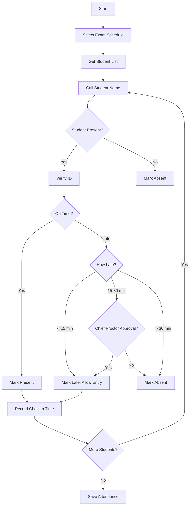
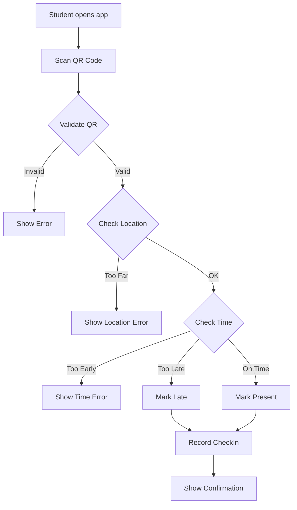
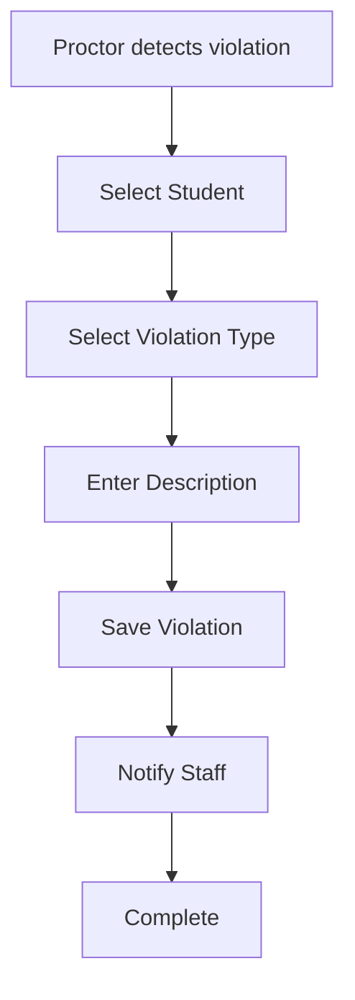

# Module 07: Attendance Management

## Overview

Quản lý điểm danh sinh viên dự thi, bao gồm ghi nhận sự có mặt, vắng mặt, và các sự cố trong phòng thi.

## Actors

| Actor | Description |
|-------|-------------|
| **Giám thị** | Điểm danh sinh viên, ghi chú sự cố |
| **Nhân viên giáo vụ** | Xem báo cáo điểm danh, xử lý vắng mặt |
| **Sinh viên** | Xem lịch sử điểm danh |

## Use Cases

### UC-07.1: Điểm danh trước khi thi

**Preconditions:**
- Ca thi sắp bắt đầu (trong vòng 30 phút)
- User là giám thị của ca thi
- User có quyền "Giảng viên"

**Main Flow:**
1. Giám thị truy cập trang điểm danh
2. System hiển thị danh sách sinh viên dự thi
3. Giám thị điểm danh từng sinh viên:
   - Kiểm tra thẻ sinh viên/CMND
   - Đánh dấu có mặt/vắng mặt
   - Ghi nhận giờ vào phòng
4. System tự động cập nhật trạng thái:
   - Present: Có mặt đúng giờ
   - Late: Đến muộn (sau giờ bắt đầu)
   - Absent: Vắng mặt
5. Giám thị hoàn tất điểm danh
6. System lưu biên bản điểm danh

**Validation Rules:**
| Field | Type | Rule |
|-------|------|------|
| ExamScheduleId | int | Required, FK → ExamSchedule |
| StudentId | int | Required, FK → Student |
| Status | string | Required, Present/Late/Absent/Excused |
| CheckInTime | DateTime? | Required if Present/Late |
| Notes | string | Optional, Max 500 |

**Business Rules:**
- Sinh viên đến muộn 5-15 phút: Được vào thi nhưng không gia hạn thời gian
- Sinh viên đến muộn 15-30 phút: Cần sự chấp thuận của giám thị chính
- Sinh viên đến muộn > 30 phút: Không được vào thi, coi như vắng mặt

---

### UC-07.2: Điểm danh QR Code

**Preconditions:**
- Hệ thống QR Code được kích hoạt
- Sinh viên có thiết bị di động
- User là sinh viên

**Main Flow:**
1. Sinh viên đến phòng thi
2. System hiển thị QR Code trên màn hình
3. Sinh viên quét QR Code bằng điện thoại
4. System ghi nhận thời gian và vị trí
5. System cập nhật trạng thái điểm danh
6. Sinh viên xem xác nhận điểm danh thành công

**Business Rules:**
- QR Code thay đổi mỗi 30 giây
- Chỉ quét được trong khoảng cách 10m từ phòng thi
- Chỉ quét được trong khoảng thời gian cho phép (30 phút trước thi)

---

### UC-07.3: Ghi chú sự cố phòng thi

**Preconditions:**
- Đang trong ca thi
- User là giám thị

**Main Flow:**
1. Giám thị phát hiện sự cố
2. Giám thị ghi chú sự cố:
   - Loại sự cố (Gian lận, Nộp bài sớm, Vấn đề sức khỏe, etc.)
   - Mô tả chi tiết
   - Sinh viên liên quan (nếu có)
3. System lưu sự cố
4. System thông báo cho nhân viên giáo vụ

**Violation Types:**
- Cheating: Gian lận
- Disruptive: Gây mất trật tự
- EarlySubmission: Nộp bài sớm
- HealthIssue: Vấn đề sức khỏe
- Other: Khác

---

### UC-07.4: Xem biên bản điểm danh

**Preconditions:**
- User có quyền "Giám thị", "Nhân viên giáo vụ", hoặc "Admin"

**Main Flow:**
1. User chọn ca thi
2. User click "Xem biên bản điểm danh"
3. System hiển thị:
   - Danh sách sinh viên
   - Trạng thái điểm danh
   - Giờ vào/ra phòng
   - Ghi chú sự cố
4. User có thể in hoặc xuất PDF

---

### UC-07.5: Xử lý vắng mặt

**Preconditions:**
- Sinh viên vắng mặt
- User có quyền "Nhân viên giáo vụ"

**Main Flow:**
1. User xem danh sách sinh viên vắng mặt
2. User chọn sinh viên cần xử lý
3. User cập nhật lý do vắng mặt:
   - Có phép (Excused)
   - Không phép (Unexcused)
4. System cập nhật trạng thái
5. System thông báo cho sinh viên (nếu có phép)

---

### UC-07.6: Sinh viên xem lịch sử điểm danh

**Preconditions:**
- Sinh viên đăng nhập

**Main Flow:**
1. Sinh viên truy cập trang điểm danh
2. System hiển thị lịch sử điểm danh:
   - Môn thi
   - Ngày thi
   - Trạng thái
   - Ghi chú (nếu có)

---

## Data Model

### Attendance Entity

```
Attendance
├── Id: int (PK, Identity)
├── ExamScheduleId: int (FK → ExamSchedule.Id, Not Null)
├── StudentId: int (FK → Student.Id, Not Null)
├── Status: string (20, Default 'Present')
├── CheckInTime: DateTime? (Null)
├── CheckOutTime: DateTime? (Null)
├── Notes: string (500, Null)
├── Violation: string (200, Null)
└── RecordedAt: DateTime (Default GETDATE())
```

### Status Enum

```
AttendanceStatus:
  - Present: Có mặt đúng giờ
  - Late: Đến muộn
  - Absent: Vắng mặt
  - Excused: Vắng có phép
```

### Violation Enum

```
ViolationType:
  - Cheating: Gian lận
  - Disruptive: Gây mất trật tự
  - EarlySubmission: Nộp bài sớm
  - HealthIssue: Vấn đề sức khỏe
  - None: Không có
```

### Relationships

```
Attendance (N) ──→ (1) ExamSchedule
Attendance (N) ──→ (1) Student
```

---

## API Endpoints

| Method | Endpoint | Description | Auth Required |
|--------|----------|-------------|---------------|
| GET | /api/attendance | Get all attendance records | Yes |
| GET | /api/attendance/{id} | Get attendance by ID | Yes |
| POST | /api/attendance | Create attendance record | Yes (Proctor) |
| PUT | /api/attendance/{id} | Update attendance | Yes (Proctor/Staff) |
| DELETE | /api/attendance/{id} | Delete attendance | Yes (Proctor) |
| GET | /api/attendance/by-schedule/{scheduleId} | Get by schedule | Yes |
| GET | /api/attendance/by-student/{studentId} | Get by student | Yes |
| POST | /api/attendance/checkin | Check-in (QR code) | Yes (Student) |
| POST | /api/attendance/checkout | Check-out | Yes (Proctor) |
| POST | /api/attendance/bulk | Bulk create attendance | Yes (Proctor) |
| PUT | /api/attendance/{id}/violation | Record violation | Yes (Proctor) |

---

## Workflows

### Manual Attendance Workflow



### QR Code Check-in Workflow



### Violation Recording Workflow



---

## Business Rules

### Check-in Rules

1. **Thời gian điểm danh**:
   - Bắt đầu: 30 phút trước giờ thi
   - Kết thúc: 15 phút sau giờ thi

2. **Phân loại vắng mặt**:
   - Present: Đến trước giờ bắt đầu
   - Late: Đến sau giờ bắt đầu nhưng trước 30 phút
   - Absent: Đến sau 30 phút hoặc không đến

3. **Quy định vào phòng thi**:
   - Late < 15 phút: Được vào, không gia hạn
   - Late 15-30 phút: Cần Chief Proctor approval
   - Late > 30 phút: Không được vào

### Violation Handling

| Violation Type | Action |
|----------------|--------|
| Cheating | Record violation, notify staff, possible disqualification |
| Disruptive | Warning, record if repeated |
| EarlySubmission | Allow if after 50% time, record time |
| HealthIssue | Provide assistance, record incident |

---

## UI Components

### Pages

| Page | Route | Description |
|------|-------|-------------|
| Attendance List | /Attendance | Danh sách điểm danh |
| Check-in | /Attendance/checkin/{scheduleId} | Điểm danh (Proctor) |
| My Attendance | /MyAttendance | Điểm danh của tôi (Student) |
| Attendance Report | /Reports/Attendance | Báo cáo điểm danh |
| Violation Log | /Attendance/violations | Sổ sự cố |

### Components

- AttendanceTable: Bảng điểm danh
- QRCodeScanner: Quét mã QR
- QRCodeDisplay: Hiển thị mã QR
- CheckInButton: Nút điểm danh
- ViolationForm: Form ghi sự cố
- AttendanceStats: Thống kê tỷ lệ có mặt

---

## Testing Scenarios

| Test Case | Description | Expected Result |
|-----------|-------------|-----------------|
| TC-001 | Create attendance (Present) | Returns 201 |
| TC-002 | Create attendance (Late) | Returns 201, status = Late |
| TC-003 | Create attendance (Absent) | Returns 201 |
| TC-004 | QR check-in (valid) | Returns 200, recorded |
| TC-005 | QR check-in (invalid QR) | Returns 400 |
| TC-006 | QR check-in (wrong location) | Returns 400 |
| TC-007 | Record violation | Returns 200 |
| TC-008 | Get attendance by student | Returns student's records |
| TC-009 | Get attendance by schedule | Returns schedule's records |
| TC-010 | Bulk create attendance | Returns 200, all recorded |

---

## Open Issues / TODOs

- [ ] Tích hợp QR Code động (thay đổi mỗi 30s)
- [ ] Geofencing cho QR check-in
- [ ] Điểm danh bằng khuôn mặt (Face Recognition)
- [ ] Gửi SMS thông báo vắng mặt cho phụ huynh
- [ ] In biên bản điểm danh với chữ ký giám thị
- [ ] Thống kê tỷ lệ dự thi theo môn/lớp
- [ ] Xử lý sinh viên xin phép vắng mặt trước
