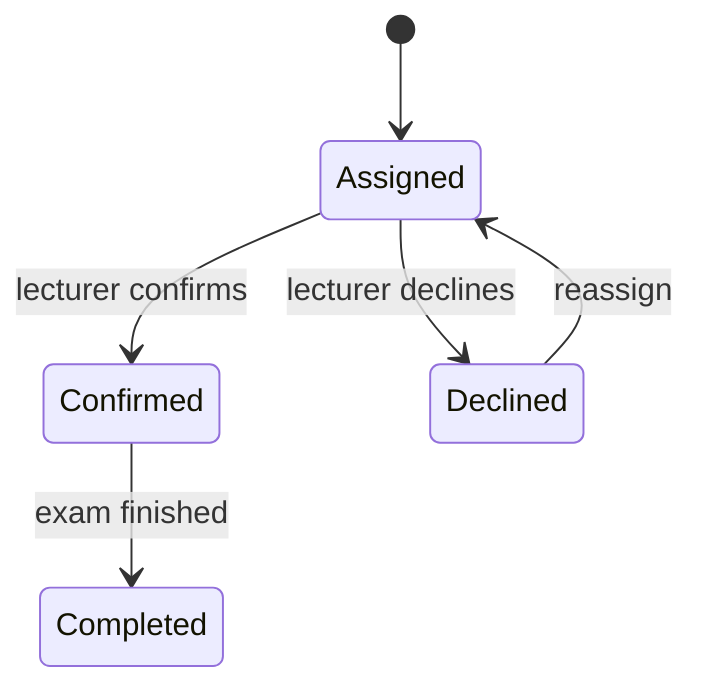

# ProctorAssignment State Diagram

```mermaid
stateDiagram-v2
    [*] --> Assigned
    Assigned --> Confirmed: lecturer confirms
    Assigned --> Declined: lecturer declines
    Declined --> Assigned: reassign
    Confirmed --> Completed: exam finished
```
