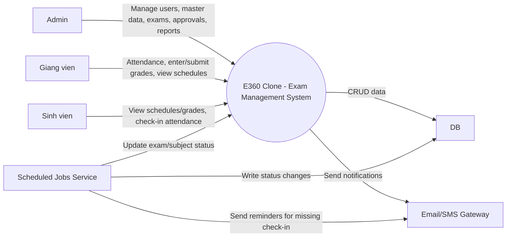

# System Context Diagram

```mermaid
flowchart LR
    %% Actors
    Admin[Admin]
    Lecturer[Giang vien]
    Student[Sinh vien]

    %% External systems
    EmailSvc[Email/SMS Gateway]
    CronJob[Scheduled Jobs Service]

    %% System boundary (black box)
    System(("E360 Clone - Exam Management System"))

    %% Interactions
    Admin -->|Manage users, master data, exams, approvals, reports| System
    Lecturer -->|Attendance, enter/submit grades, view schedules| System
    Student -->|View schedules/grades, check-in attendance| System

    System -->|CRUD data| DB
    System -->|Send notifications| EmailSvc

    CronJob -->|Update exam/subject status| System
    CronJob -->|Write status changes| DB
    CronJob -->|Send reminders for missing check-in| EmailSvc
```
