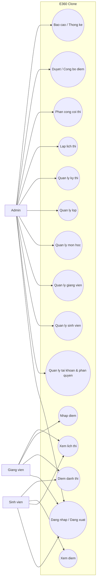

# Use Case Diagram

```mermaid
flowchart LR
    %% Actors
    Admin[Admin]
    Lecturer[Giang vien]
    Student[Sinh vien]

    %% System boundary
    subgraph System[E360 Clone]
        UC_Login((Dang nhap / Dang xuat))
        UC_ManageUsers((Quan ly tai khoan & phan quyen))
        UC_ManageStudents((Quan ly sinh vien))
        UC_ManageLecturers((Quan ly giang vien))
        UC_ManageSubjects((Quan ly mon hoc))
        UC_ManageClasses((Quan ly lop))
        UC_ManageExams((Quan ly ky thi))
        UC_ManageSchedules((Lap lich thi))
        UC_ProctorAssign((Phan cong coi thi))
        UC_Attendance((Diem danh thi))
        UC_EnterGrades((Nhap diem))
        UC_ApproveGrades((Duyet / Cong bo diem))
        UC_ViewSchedule((Xem lich thi))
        UC_ViewGrades((Xem diem))
        UC_Reports((Bao cao / Thong ke))
    end

    %% Actor -> Use Cases
    Admin --> UC_Login
    Admin --> UC_ManageUsers
    Admin --> UC_ManageStudents
    Admin --> UC_ManageLecturers
    Admin --> UC_ManageSubjects
    Admin --> UC_ManageClasses
    Admin --> UC_ManageExams
    Admin --> UC_ManageSchedules
    Admin --> UC_ProctorAssign
    Admin --> UC_ApproveGrades
    Admin --> UC_Reports


    Lecturer --> UC_Login
    Lecturer --> UC_Attendance
    Lecturer --> UC_EnterGrades
    Lecturer --> UC_ViewSchedule

    Student --> UC_Login
    Student --> UC_ViewSchedule
    Student --> UC_ViewGrades
    Student --> UC_Attendance
```
