# Workflow: Attendance Management Process

## Overview

Quy trình điểm danh sinh viên dự thi, từ khi vào phòng thi đến khi nộp bài và ra phòng.

## Actors

| Actor | Responsibilities |
|-------|------------------|
| **Giám thị** | Điểm danh, kiểm tra danh tính, ghi sự cố |
| **Sinh viên** | Có mặt đúng giờ, xuất trình thẻ |
| **Nhân viên giáo vụ** | Xử lý vắng mặt, xem báo cáo |

---

## Phase 1: Chuẩn bị điểm danh

### 1.1 Trước giờ thi 30 phút

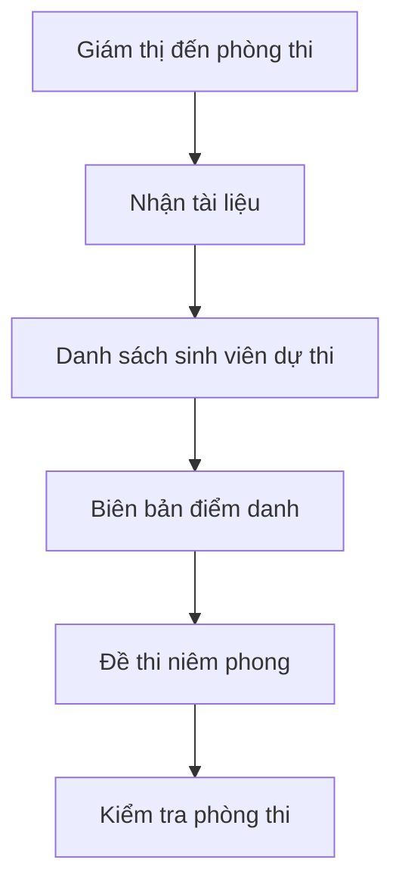

**Checklist:**
- [ ] Danh sách sinh viên dự thi (in ra)
- [ ] Biên bản điểm danh (blank form)
- [ ] Bút viết
- [ ] Đồng hồ
- [ ] Máy quét QR code (nếu dùng)

---

### 1.2 Hiển thị QR Code (nếu áp dụng)

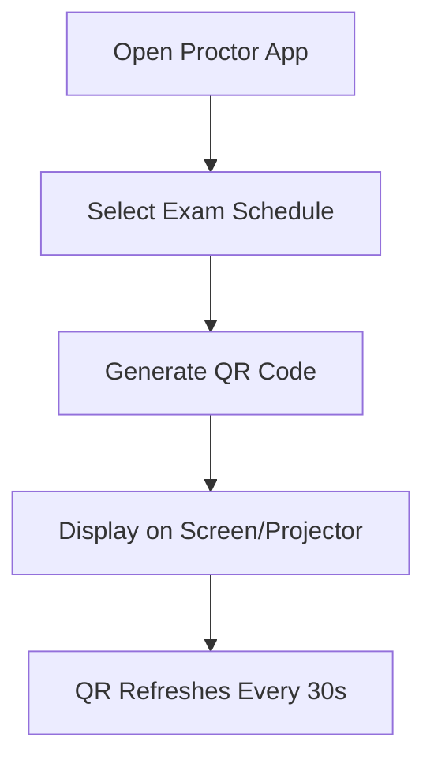

**QR Code Content:**
```json
{
  "scheduleId": 123,
  "roomId": 45,
  "timestamp": "2024-06-15T07:30:00Z",
  "expiresAt": "2024-06-15T07:30:30Z",
  "signature": "abc123xyz"
}
```

---

## Phase 2: Điểm danh vào phòng

### 2.1 Sinh viên đến phòng thi

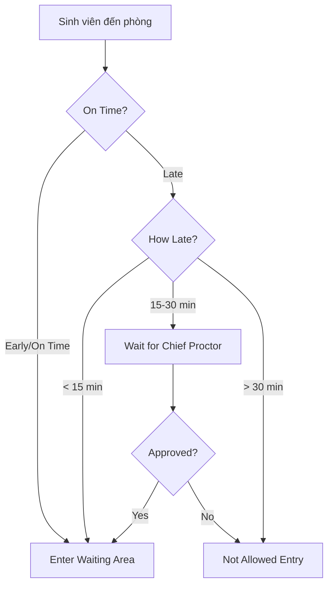

**Time Windows:**

| Arrival Time | Status | Action |
|--------------|--------|--------|
| > 30 min before | Early | Wait outside |
| 0-30 min before | On Time | Enter normally |
| 0-15 min after | Late (< 15) | Enter, no extension |
| 15-30 min after | Late (15-30) | Chief Proctor decision |
| > 30 min after | Very Late | Not allowed |

---

### 2.2 Điểm danh thủ công

```mermaid
graph TD
    A[Call Student Name] --> B[Student Presents ID]
    B --> C[Verify Identity]
    C -->{Match?}
    C -->|No| D[Deny Entry]
    C -->|Yes| E[Mark Present]
    E --> F[Record CheckIn Time]
    F --> G[Student Takes Seat]
```

**Verification Steps:**
1. Yêu cầu sinh viên xuất trình:
   - Thẻ sinh viên, hoặc
   - CMND/CCCD
2. So sánh ảnh với người
3. Kiểm tra tên trong danh sách
4. Đánh dấu vào biên bản

**Manual Attendance Sheet:**
```
BIÊN BẢN ĐIỂM DANH
Môn: _______________  Ngày: _______________
Phòng: _____________  Giờ: _______________

STT | Mã SV | Họ tên | Chữ ký | Ghi chú
----|-------|--------|--------|---------
 1  |       |        |        |
 2  |       |        |        |
```

---

### 2.3 Điểm danh QR Code

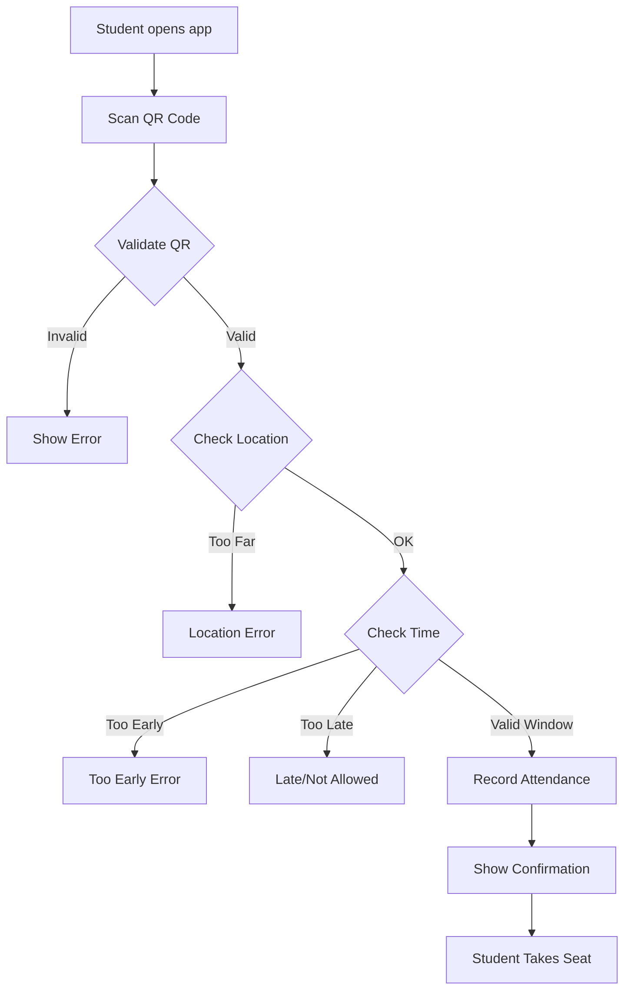

**Validation Logic:**
```javascript
function validateCheckIn(qrData, studentLocation, currentTime) {
  const errors = [];
  
  // Verify QR signature
  if (!verifySignature(qrData.signature)) {
    errors.push('Invalid QR code');
  }
  
  // Check location (within 10m of exam room)
  const distance = calculateDistance(studentLocation, qrData.roomLocation);
  if (distance > 10) {
    errors.push('You must be near the exam room');
  }
  
  // Check time window
  const timeDiff = currentTime - qrData.timestamp;
  if (timeDiff < -30 * 60) { // 30 min before
    errors.push('Too early to check in');
  }
  if (timeDiff > 15 * 60) { // 15 min after
    errors.push('Check-in closed');
  }
  
  return errors;
}
```

---

## Phase 3: Xử lý vắng mặt

### 3.1 Phân loại vắng mặt

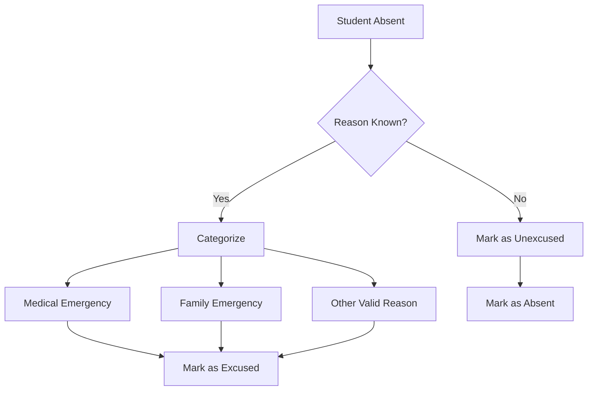

**Status Codes:**
| Code | Description | Documentation Required |
|------|-------------|----------------------|
| Present | Có mặt | None |
| Late | Đến muộn | None |
| Absent | Vắng mặt (không phép) | None |
| Excused | Vắng có phép | Medical cert, etc. |

---

### 3.2 Cập nhật lý do vắng mặt

```mermaid
graph TD
    A[Staff receives absence notice] --> B[Review Documentation]
    B --> C{Valid Reason?}
    C -->|No| D[Keep as Absent]
    C -->|Yes| E[Update to Excused]
    E --> F[Notify Student]
    F --> G[Schedule Make-up (if applicable)]
```

**Valid Excuse Documents:**
- Giấy khám bệnh (từ bệnh viện)
- Giấy chứng nhận tang lễ
- Giấy triệu tập tòa án
- Giấy xác nhận của công an

---

## Phase 4: Ghi nhận sự cố

### 4.1 Phát hiện sự cố

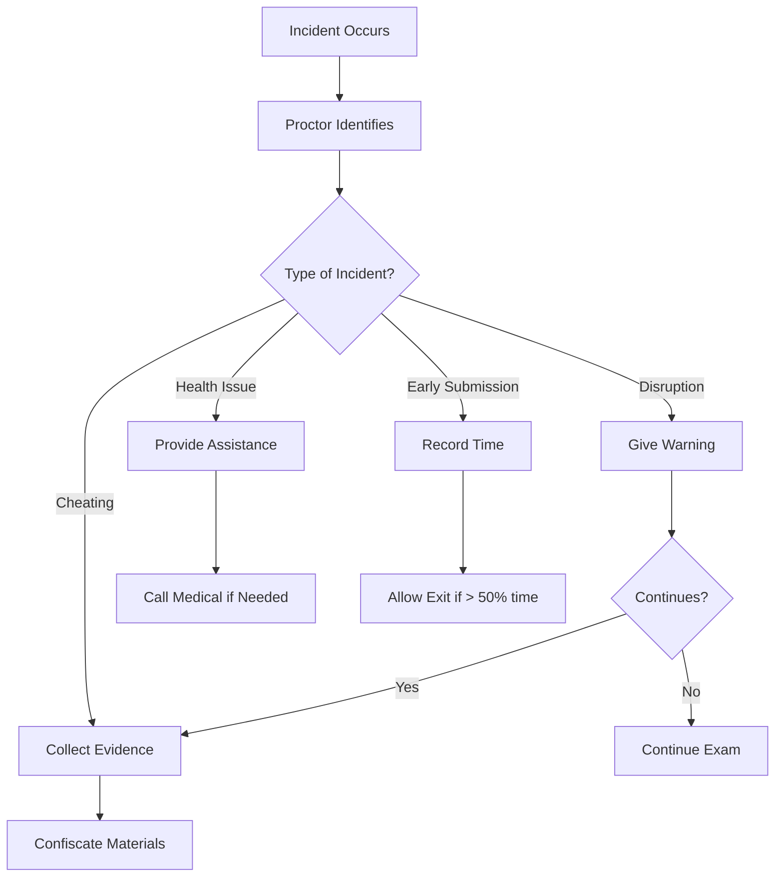

---

### 4.2 Lập biên bản sự cố

```mermaid
graph TD
    A[Open Incident Form] --> B[Select Student(s)]
    B --> C[Select Violation Type]
    C --> D[Enter Description]
    D --> E[Attach Evidence]
    E --> F[Save Incident]
    F --> G[Notify Admin]
    G --> H[Student Signs (if possible)]
```

**Incident Report Form:**
```
BIÊN BẢN SỰ CỐ PHÒNG THI

Phòng thi: _______  Ngày: ___________
Giám thị 1: _______  Giám thị 2: _______

Sinh viên vi phạm:
- Mã SV: ___________  Họ tên: ___________
- Mã SV: ___________  Họ tên: ___________

Loại vi phạm:
[ ] Gian lận (sử dụng tài liệu, trao đổi bài)
[ ] Gây mất trật tự
[ ] Nộp bài sớm
[ ] Vấn đề sức khỏe
[ ] Khác: _________________

Mô tả chi tiết:
_______________________________________________
_______________________________________________

Biện pháp xử lý:
_______________________________________________

Chữ ký giám thị: _________________
Chữ ký sinh viên (nếu có): _________________
```

---

## Phase 5: Thu bài và điểm danh ra

### 5.1 Thu bài thi

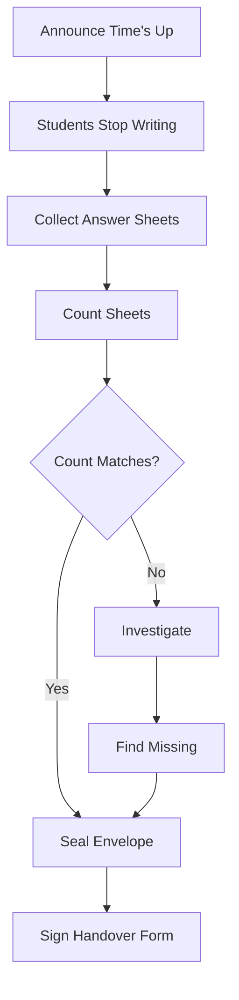

---

### 5.2 Điểm danh ra phòng

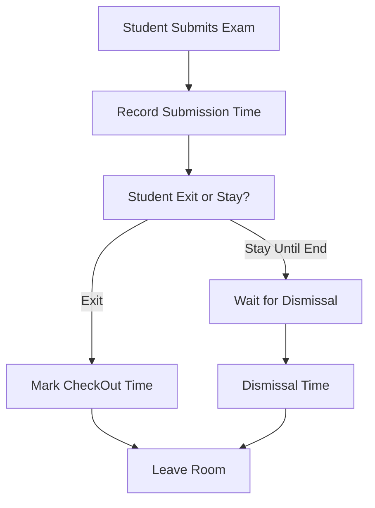

**Checkout Recording:**
| Student ID | Name | CheckIn | CheckOut | Duration |
|------------|------|---------|----------|----------|
| SV001 | Nguyễn Văn A | 7:45 | 9:30 | 105 min |
| SV002 | Trần Thị B | 7:50 | 9:45 | 115 min |

---

## Phase 6: Hoàn thành biên bản

### 6.1 Tổng hợp điểm danh

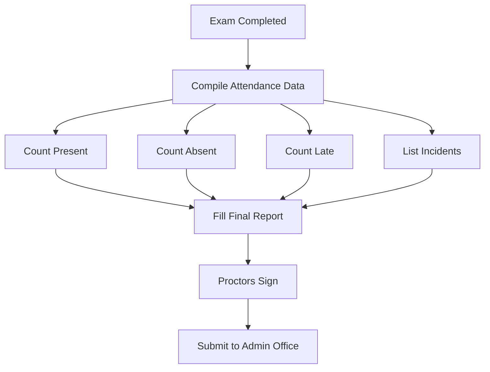

---

### 6.2 Nộp biên bản

```mermaid
graph TD
    A[Proctors to Admin Office] --> B[Submit Documents]
    B --> C[Answer Sheets]
    B --> D[Attendance Sheet]
    B --> E[Incident Reports]
    B --> F[Exam Booklet (if unused)]
    C --> G[Admin Receives]
    D --> G
    E --> G
    F --> G
    G --> H[Verify Completeness]
    H --> I[File Documents]
```

**Submission Checklist:**
- [ ] Bài thi (đã niêm phong)
- [ ] Biên bản điểm danh
- [ ] Biên bản sự cố (nếu có)
- [ ] Đề thi thừa (nếu có)
- [ ] Danh sách sinh viên nộp bài

---

## Phase 7: Xử lý sau điểm danh

### 7.1 Nhập dữ liệu điểm danh

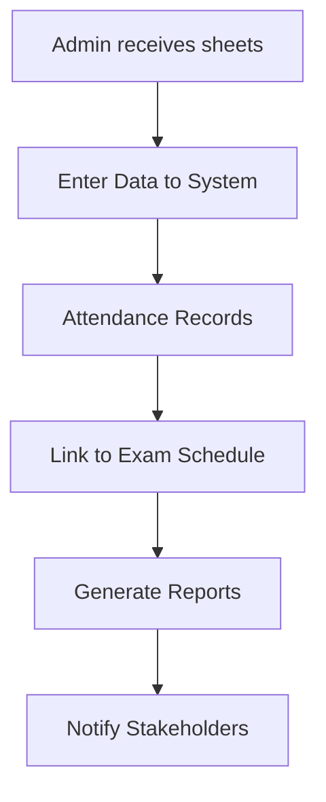

**Data Entry:**
```json
{
  "examScheduleId": 123,
  "attendances": [
    {
      "studentId": 1,
      "status": "Present",
      "checkInTime": "2024-06-15T07:45:00Z",
      "checkOutTime": "2024-06-15T09:30:00Z"
    },
    {
      "studentId": 2,
      "status": "Absent",
      "notes": "No show"
    }
  ]
}
```

---

### 7.2 Báo cáo điểm danh

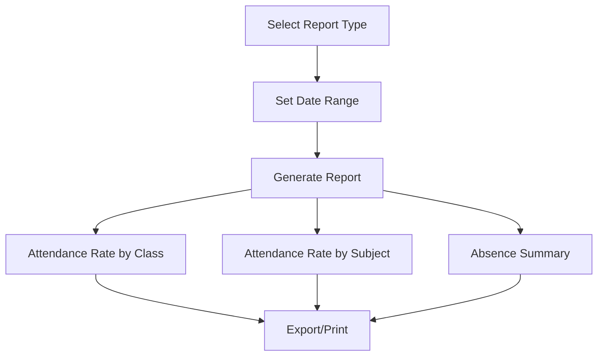

**Report Metrics:**
- Tỷ lệ có mặt (Attendance Rate)
- Tỷ lệ vắng mặt (Absence Rate)
- Số lần đi muộn (Late Count)
- Số sự cố (Incident Count)

---

## API Endpoints

| Method | Endpoint | Description |
|--------|----------|-------------|
| POST | /api/attendance | Create attendance record |
| PUT | /api/attendance/{id} | Update attendance |
| POST | /api/attendance/checkin | QR check-in |
| POST | /api/attendance/checkout | Check-out |
| PUT | /api/attendance/{id}/violation | Record violation |
| GET | /api/attendance/by-schedule/{id} | Get by schedule |
| GET | /api/attendance/by-student/{id} | Get by student |
| GET | /api/attendance/report | Generate report |

---

## KPIs & Metrics

| Metric | Target | Formula |
|--------|--------|---------|
| Tỷ lệ có mặt | > 95% | Present / Total students |
| Tỷ lệ đi muộn | < 5% | Late / Total students |
| Tỷ lệ vắng không phép | < 3% | Unexcused / Total students |
| Thời gian điểm danh | < 30 phút | From start to completion |
| Số sự cố phòng thi | < 2% | Incidents / Total exams |

---

## Common Issues & Solutions

| Issue | Solution |
|-------|----------|
| Sinh viên quên thẻ | Xác minh qua CMND/CCCD, cho thi với cảnh cáo |
| Sinh viên đi nhầm phòng | Hướng dẫn sang phòng đúng, ghi nhận late nếu quá giờ |
| Hệ thống QR code lỗi | Chuyển sang điểm danh thủ công |
| Sinh viên ký nhầm ô | Yêu cầu ký lại, gạch chéo ô sai |
| Thiếu bài thi | Kiểm tra lại phong bì, liên hệ sinh viên |

---

## Audit Trail

All attendance changes are logged:

```json
{
  "attendanceId": 456,
  "action": "UPDATE",
  "oldValue": { "status": "Absent" },
  "newValue": { "status": "Excused" },
  "changedBy": "staff@e360.edu.vn",
  "changedAt": "2024-06-16T09:00:00Z",
  "reason": "Medical certificate submitted"
}
```
