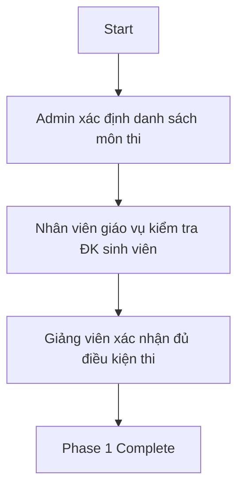
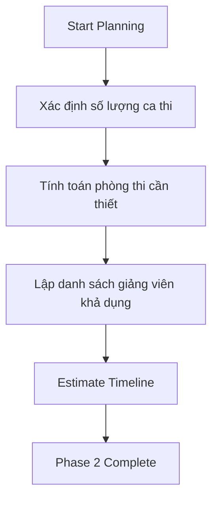
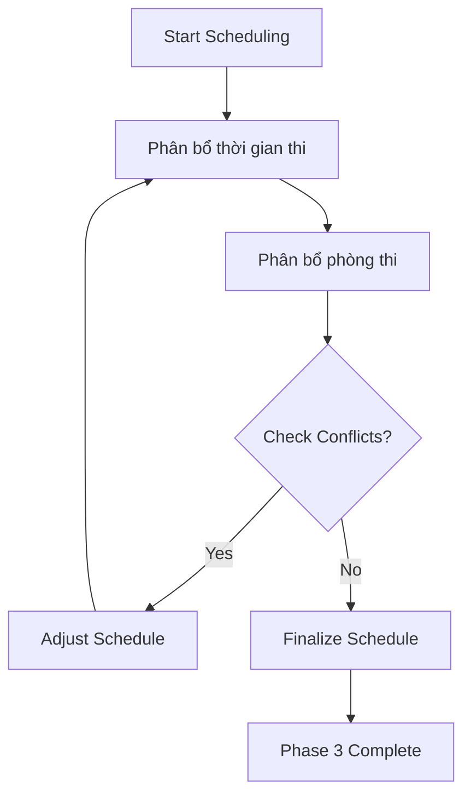
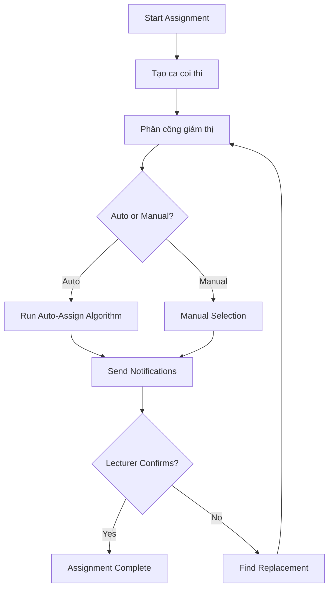
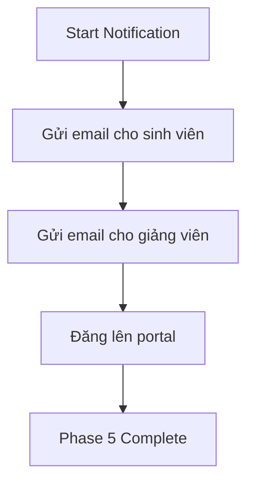
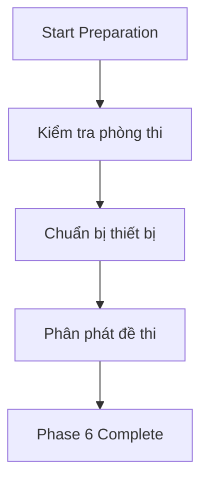
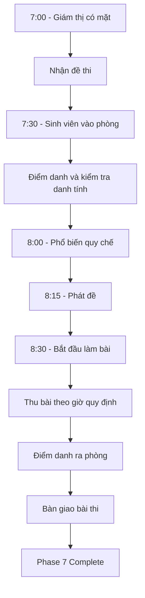
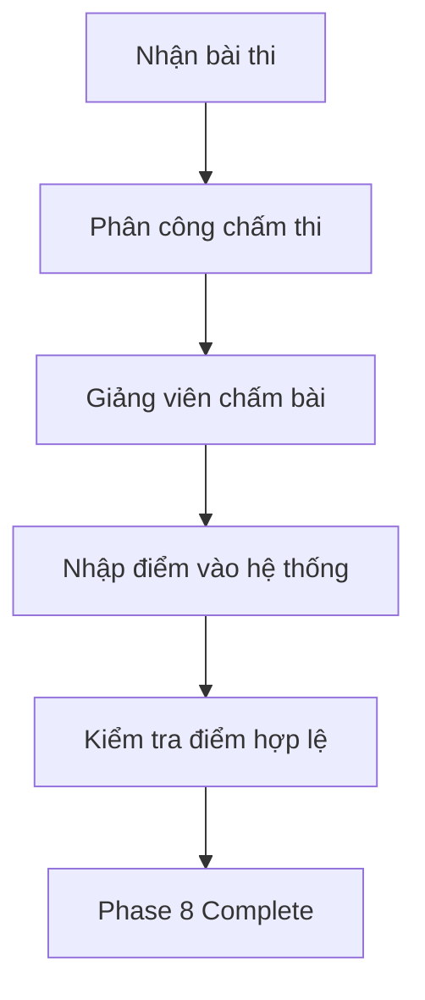
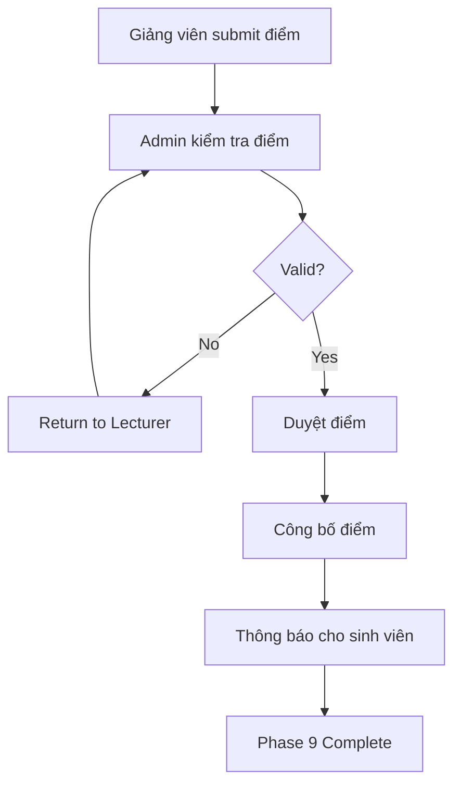
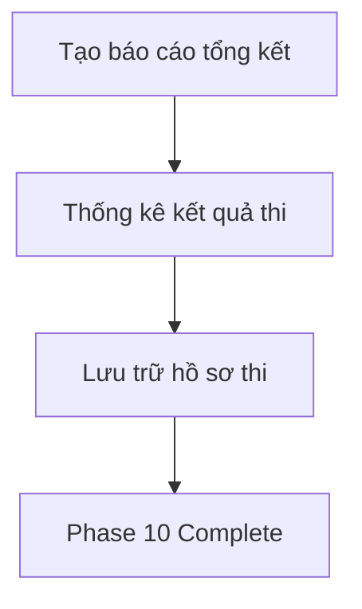

# Workflow: Exam Organization Process

## Overview

Quy trình tổ chức kỳ thi toàn diện, từ lập kế hoạch đến công bố kết quả.

## Actors

| Actor | Responsibilities |
|-------|------------------|
| **Admin** | Giám sát toàn bộ quy trình |
| **Nhân viên giáo vụ** | Thực hiện các bước tổ chức thi |
| **Giảng viên** | Coi thi, chấm thi, nhập điểm |
| **Sinh viên** | Dự thi, xem kết quả |

## Timeline

### Phase 1: Chuẩn bị kỳ thi (Tuần 1-2)



**Activities:**
1. Admin xem danh sách môn học trong kỳ
2. Admin lọc môn cần thi (lý thuyết, thực hành)
3. Nhân viên giáo vụ kiểm tra:
   - Sinh viên đủ điều kiện dự thi (không nợ học phí)
   - Số buổi học tối thiểu (75%)
4. Giảng viên xác nhận chương trình đã giảng xong

**Deliverables:**
- Danh sách môn thi
- Danh sách sinh viên đủ điều kiện thi
- Xác nhận từ giảng viên

---

### Phase 2: Lập kế hoạch thi (Tuần 3)



**Activities:**
1. Nhân viên giáo vụ lập kế hoạch chi tiết:
   - Số ca thi dựa trên số môn, số sinh viên
   - Thời lượng mỗi ca (60-180 phút)
   - Số phòng thi cần thiết
2. Tính toán nhân sự:
   - Số giám thị cần thiết (2/ca)
   - Danh sách giảng viên khả dụng
3. Dự trù kinh phí (nếu có)

**Deliverables:**
- Kế hoạch tổ chức kỳ thi
- Dự toán nhân sự, phòng thi

---

### Phase 3: Lập lịch thi (Tuần 4)



**Activities:**
1. Nhân viên giáo vụ tạo lịch thi chi tiết:
   - Ngày thi cho mỗi môn
   - Giờ bắt đầu/kết thúc
   - Phòng thi
2. Kiểm tra xung đột:
   - Sinh viên thi trùng môn
   - Giảng viên coi thi trùng giờ
   - Phòng thi trùng lịch
3. Xuất lịch thi dự kiến

**Business Rules:**
- Không thi 2 môn trong cùng 1 ngày cho 1 lớp
- Giám thị không coi quá 2 ca/ngày
- Phòng thi có sức chứa >= số sinh viên

**Deliverables:**
- Lịch thi chi tiết
- Danh sách phòng thi
- Báo cáo xung đột (nếu có)

---

### Phase 4: Phân công coi thi (Tuần 5)



**Activities:**
1. Tạo ca coi thi cho mỗi lịch thi
2. Phân công giám thị:
   - Tự động (algorithm dựa trên availability)
   - Thủ công (chọn giảng viên cụ thể)
3. Gửi thông báo cho giảng viên
4. Giảng viên xác nhận/từ chối
5. Tìm người thay thế nếu từ chối

**Deliverables:**
- Danh sách phân công coi thi
- Biên bản phân công

---

### Phase 5: Thông báo lịch thi (Cuối Tuần 5)



**Activities:**
1. Gửi email thông báo cho sinh viên:
   - Lịch thi chi tiết
   - Quy chế thi
   - Địa điểm, phòng thi
2. Gửi thông báo cho giảng viên:
   - Lịch coi thi
   - Môn thi phụ trách
3. Đăng lịch thi lên portal

**Template Email:**
```
Subject: Lịch thi Học kỳ 2 - Năm học 2024-2025

Kính chào sinh viên,

Lịch thi của bạn đã được sắp xếp:
- Môn: [Tên môn]
- Ngày: [DD/MM/YYYY]
- Giờ: [HH:MM]
- Phòng: [Số phòng]
- Địa điểm: [Tòa nhà]

Vui lòng có mặt trước 15 phút để làm thủ tục.
```

**Deliverables:**
- Email đã gửi
- Lịch thi trên portal

---

### Phase 6: Chuẩn bị phòng thi (Ngày thi trước 1-2 ngày)



**Activities:**
1. Kiểm tra phòng thi:
   - Vệ sinh phòng
   - Đèn, quạt, điều hòa
   - Bảng viết
2. Chuẩn bị thiết bị:
   - Máy chiếu (nếu cần)
   - Giấy thi, bút viết
3. Phân phát đề thi cho giám thị:
   - Đề thi đã niêm phong
   - Biên bản điểm danh
   - Danh sách sinh viên dự thi

**Checklist:**
- [ ] Phòng sạch sẽ
- [ ] Đèn hoạt động
- [ ] Điều hòa hoạt động
- [ ] Bảng viết sạch
- [ ] Đề thi đã niêm phong
- [ ] Giấy thi đủ
- [ ] Biên bản điểm danh

**Deliverables:**
- Phòng thi sẵn sàng
- Đề thi đã phân phát

---

### Phase 7: Tổ chức thi (Ngày thi)



**Timeline chi tiết:**

| Thời gian | Hoạt động |
|-----------|-----------|
| 7:00-7:30 | Giám thị có mặt, nhận đề thi |
| 7:30-8:00 | Sinh viên vào phòng, điểm danh |
| 8:00-8:15 | Phổ biến quy chế thi |
| 8:15-8:30 | Phát đề, kiểm tra đề |
| 8:30-10:30 | Thời gian làm bài (120 phút) |
| 10:30-10:45 | Thu bài, điểm danh ra phòng |
| 10:45-11:00 | Bàn giao bài thi cho phòng giáo vụ |

**Xử lý sự cố:**

| Sự cố | Xử lý |
|-------|-------|
| Sinh viên đi muộn < 15 phút | Cho vào thi, không gia hạn |
| Sinh viên đi muộn 15-30 phút | Cần Chief Proctor approval |
| Sinh viên đi muộn > 30 phút | Không cho vào thi |
| Gian lận | Lập biên bản, thu bài |
| Đề thi thiếu/trang khuyết | Báo cáo ngay cho phòng giáo vụ |

**Deliverables:**
- Bài thi đã thu
- Biên bản điểm danh
- Biên bản sự cố (nếu có)

---

### Phase 8: Chấm thi và nhập điểm (Tuần 9-10)



**Activities:**
1. Phòng giáo vụ phân phát bài thi cho giảng viên
2. Giảng viên chấm bài theo đáp án
3. Nhập điểm vào hệ thống:
   - Điểm số (0-10)
   - Điểm chữ (A, B, C, D, F)
   - Ghi chú (nếu có)
4. Kiểm tra điểm hợp lệ:
   - Điểm trong khoảng 0-10
   - Điểm chữ phù hợp
   - Không có điểm null

**Deliverables:**
- Bài thi đã chấm
- Điểm đã nhập vào hệ thống (Status = Draft)

---

### Phase 9: Duyệt và công bố điểm (Tuần 11)



**Activities:**
1. Giảng viên submit điểm để duyệt
2. Admin/Nhân viên giáo vụ kiểm tra:
   - Điểm đầy đủ
   - Điểm hợp lệ
   - Phân loại điểm (GPA)
3. Duyệt điểm (Status = Approved)
4. Công bố điểm (Status = Published)
5. Gửi email thông báo cho sinh viên

**Deliverables:**
- Điểm đã công bố
- Email thông báo

---

### Phase 10: Báo cáo và tổng kết (Tuần 12)



**Activities:**
1. Tạo báo cáo tổng kết kỳ thi:
   - Số môn thi
   - Số sinh viên dự thi
   - Tỷ lệ đậu/rớt
   - Phân loại điểm
2. Thống kê theo môn, lớp, ngành
3. Lưu trữ hồ sơ:
   - Bài thi (lưu 1 năm)
   - Biên bản điểm danh
   - Bảng điểm

**Reports:**
- Báo cáo kết quả thi theo môn
- Báo cáo kết quả thi theo lớp
- Báo cáo kết quả thi theo ngành
- Thống kê GPA học kỳ

**Deliverables:**
- Báo cáo tổng kết
- Hồ sơ lưu trữ

---

## Summary: Key Milestones

| Week | Phase | Milestone |
|------|-------|-----------|
| 1-2 | Preparation | Danh sách môn thi, ĐK sinh viên |
| 3 | Planning | Kế hoạch tổ chức kỳ thi |
| 4 | Scheduling | Lịch thi chi tiết |
| 5 | Assignment | Phân công coi thi |
| 5 | Notification | Thông báo lịch thi |
| 6-8 | Execution | Tổ chức thi |
| 9-10 | Grading | Chấm thi, nhập điểm |
| 11 | Publishing | Duyệt và công bố điểm |
| 12 | Closing | Báo cáo, tổng kết |

---

## KPIs & Metrics

| Metric | Target | Measurement |
|--------|--------|-------------|
| Tỷ lệ sinh viên dự thi | > 95% | Attendance / Total students |
| Tỷ lệ đậu | 80-95% | Passed / Total attendees |
| Thời gian nhập điểm | < 7 ngày sau thi | Days from exam to grade entry |
| Tỷ lệ từ chối coi thi | < 10% | Declined / Total assignments |
| Số sự cố phòng thi | < 5% | Incidents / Total exams |

---

## Risk Management

| Risk | Probability | Impact | Mitigation |
|------|-------------|--------|------------|
| Sinh viên vắng mặt nhiều | Medium | High | Gửi nhắc nhở, ĐK học vụ |
| Giám thị nghỉ đột xuất | Low | High | Danh sách dự bị |
| Phòng thi hỏng thiết bị | Low | Medium | Kiểm tra trước, phòng dự phòng |
| Đề thi bị làm lộ | Very Low | Critical | Bảo mật nghiêm ngặt, đề dự phòng |
| Hệ thống lỗi khi nhập điểm | Low | Medium | Backup manual process |
