# Workflow: Grade Management Process

## Overview

Quy trình quản lý điểm thi từ khi nhập điểm đến công bố kết quả cho sinh viên.

## Actors

| Actor | Responsibilities |
|-------|------------------|
| **Giảng viên** | Chấm thi, nhập điểm, submit điểm |
| **Admin/Nhân viên giáo vụ** | Duyệt điểm, công bố điểm |
| **Sinh viên** | Xem điểm, khiếu nại (nếu có) |

## Grade Status Flow

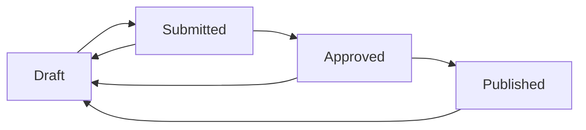

| Status | Description | Can Edit? | Who Can Edit |
|--------|-------------|-----------|--------------|
| Draft | Nháp, đang nhập | Yes | Lecturer |
| Submitted | Đã submit chờ duyệt | No | - |
| Approved | Đã duyệt | No | - |
| Published | Đã công bố | No | - |

---

## Phase 1: Chấm thi

### 1.1 Nhận bài thi

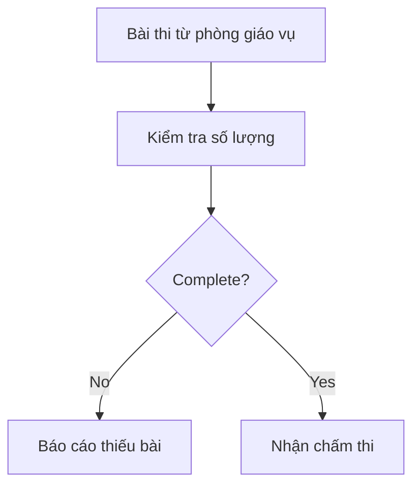

**Checklist:**
- [ ] Số bài thi khớp với biên bản điểm danh
- [ ] Bài thi không rách nát, hư hỏng
- [ ] Đề thi kèm theo (nếu có)

---

### 1.2 Chấm bài

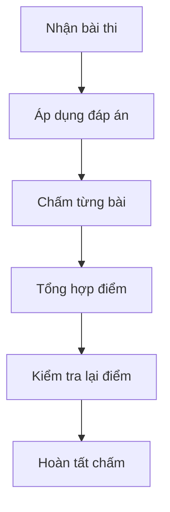

**Best Practices:**
- Chấm theo rubric đã công bố
- Chấm 2 vòng để đảm bảo công bằng
- Đánh dấu các bài thi đặc biệt (điểm cao/thấp bất thường)

---

## Phase 2: Nhập điểm

### 2.1 Truy cập hệ thống

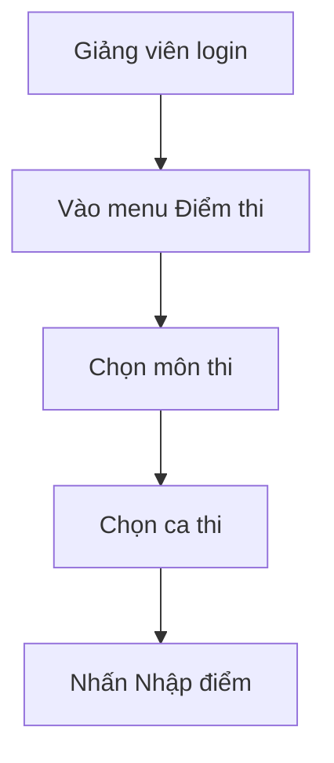

---

### 2.2 Nhập điểm chi tiết

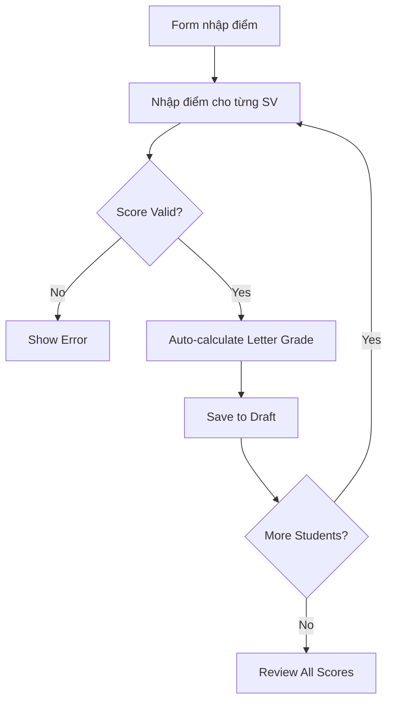

**Data Entry Form:**

| Field | Type | Validation |
|-------|------|------------|
| Student | Display | Read-only |
| Score | Number | 0-10, 1 decimal |
| Letter Grade | Auto | Based on score |
| Notes | Text | Optional, max 500 chars |

**Grade Scale:**
```
A:  8.5 - 10.0  (Excellent)
B:  7.0 - 8.4   (Good)
C:  5.5 - 6.9   (Average)
D:  4.0 - 5.4   (Below Average)
F:  0.0 - 3.9   (Fail)
```

---

### 2.3 Kiểm tra điểm trước khi submit

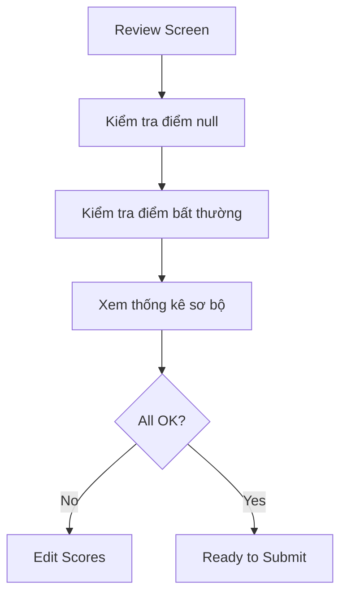

**Statistics to Review:**
- Average score (điểm trung bình)
- Standard deviation (độ lệch chuẩn)
- Grade distribution (phân bố điểm)
- Pass rate (tỷ lệ đậu)

**Red Flags:**
- Điểm trung bình < 4.0 hoặc > 9.0
- Độ lệch chuẩn > 3.0
- Tỷ lệ đậu < 50% hoặc = 100%

---

## Phase 3: Submit điểm

### 3.1 Submit để duyệt

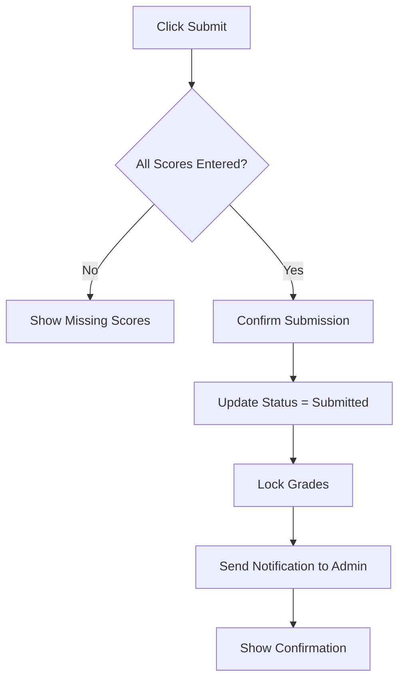

**Validation Before Submit:**
```javascript
function validateSubmission(grades) {
  const errors = [];
  
  // Check for null scores
  const nullScores = grades.filter(g => g.score === null);
  if (nullScores.length > 0) {
    errors.push(`${nullScores.length} students have no score`);
  }
  
  // Check for invalid scores
  const invalidScores = grades.filter(g => g.score < 0 || g.score > 10);
  if (invalidScores.length > 0) {
    errors.push(`${invalidScores.length} scores out of range`);
  }
  
  // Check for unusual distribution
  const avg = calculateAverage(grades);
  if (avg < 3 || avg > 9) {
    errors.push(`Unusual average: ${avg}. Please review.`);
  }
  
  return errors;
}
```

---

### 3.2 Email thông báo

**Template: Submission Notification**
```
Subject: Điểm thi cần duyệt - [Môn thi] - [Lớp]

Kính gửi Phòng Giáo vụ,

Giảng viên: [Tên giảng viên]
Môn thi: [Tên môn]
Lớp: [Tên lớp]
Số sinh viên: [Số lượng]
Thời gian submit: [DD/MM/YYYY HH:mm]

Điểm đã được nhập và chờ duyệt.
Vui lòng kiểm tra và duyệt điểm.

Trân trọng,
Hệ thống E360
```

---

## Phase 4: Duyệt điểm

### 4.1 Admin kiểm tra điểm

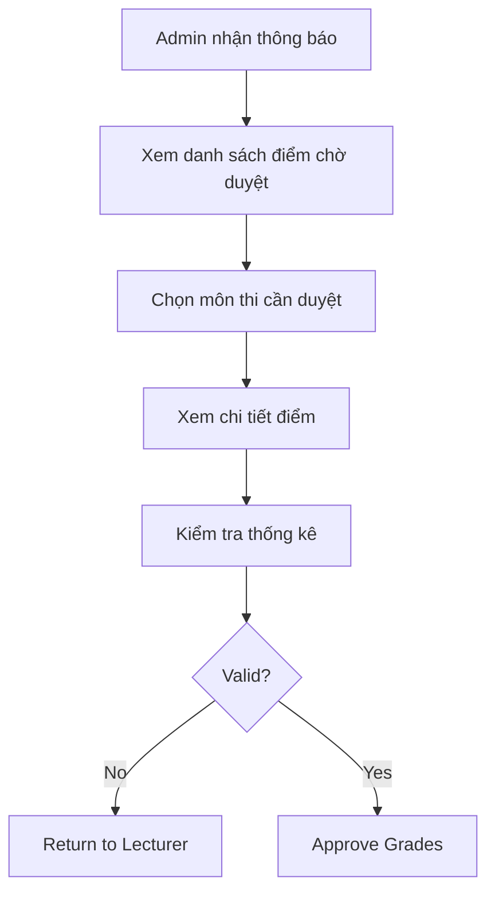

**Review Checklist:**
- [ ] Tất cả sinh viên đã có điểm
- [ ] Điểm trong khoảng hợp lệ (0-10)
- [ ] Điểm chữ khớp với điểm số
- [ ] Thống kê điểm bình thường
- [ ] Không có khiếu nại từ sinh viên

---

### 4.2 Duyệt điểm

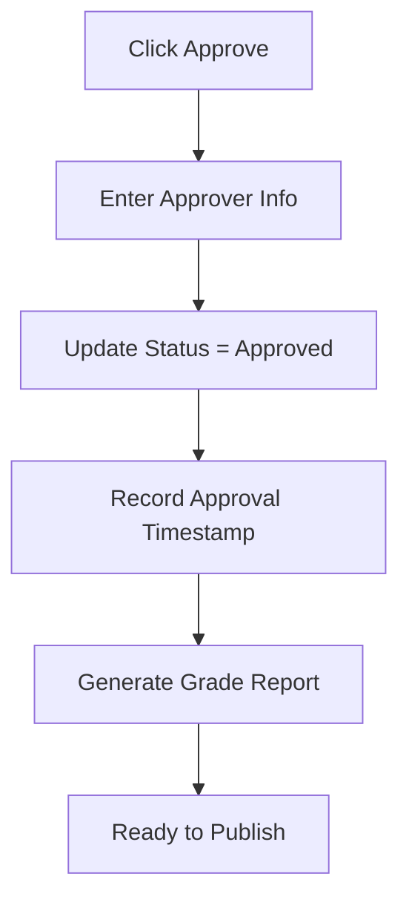

**Approval Record:**
```json
{
  "gradeId": 123,
  "approvedBy": "admin@e360.edu.vn",
  "approvedAt": "2024-06-15T10:30:00Z",
  "previousStatus": "Submitted",
  "newStatus": "Approved"
}
```

---

### 4.3 Từ chối điểm (Return to Lecturer)

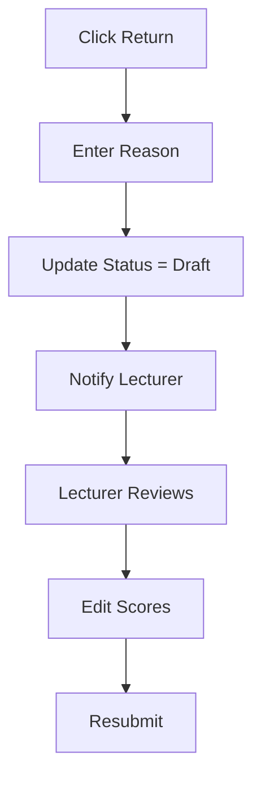

**Template: Return Notification**
```
Subject: Điểm thi cần chỉnh sửa - [Môn thi]

Kính gửi Giảng viên [Tên],

Điểm thi môn [Tên môn] - Lớp [Tên lớp] cần chỉnh sửa:

Lý do: [Chi tiết lý do]

Vui lòng kiểm tra và cập nhật lại điểm.

Trân trọng,
Phòng Giáo vụ
```

---

## Phase 5: Công bố điểm

### 5.1 Chuẩn bị công bố

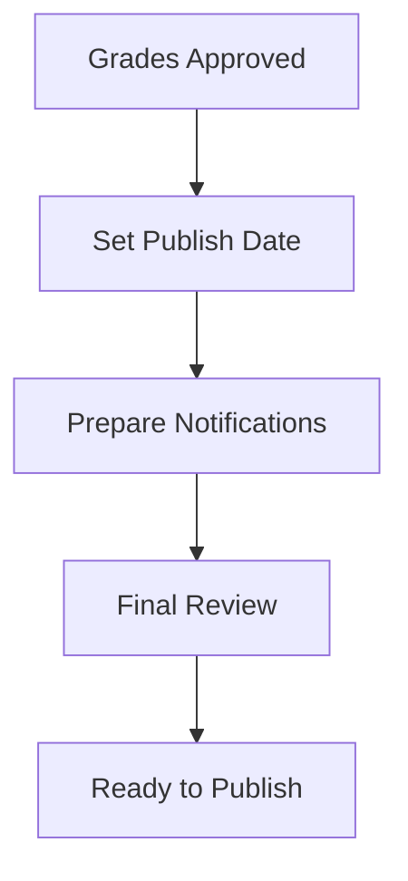

**Publishing Rules:**
- Điểm được công bố theo lịch quy định
- Thông báo trước 24 giờ
- Sinh viên được xem điểm trong bao lâu

---

### 5.2 Công bố điểm

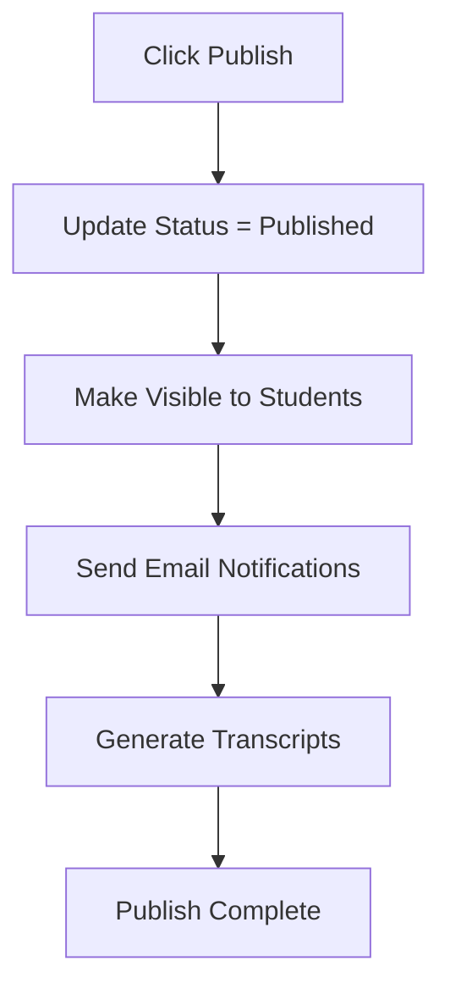

**Email Template: Grade Published**
```
Subject: Điểm thi đã công bố - Học kỳ 2/2024

Kính chào sinh viên,

Điểm thi học kỳ 2 đã được công bố.

Xem điểm tại: [Link to portal]

Thời gian khiếu nại: 7 ngày từ hôm nay.

Trân trọng,
Phòng Giáo vụ
```

---

## Phase 6: Khiếu nại điểm (Nếu có)

### 6.1 Sinh viên khiếu nại

```mermaid
graph TD
    A[Sinh viên xem điểm] --> B{Disagree?}
    B -->|Yes| C[Submit Appeal]
    B -->|No| D[End]
    C --> E[Enter Reason]
    E --> F[Attach Evidence (optional)]
    F --> G[Submit to System]
    G --> H[Notify Admin & Lecturer]
```

**Appeal Form:**
- Môn thi
- Điểm hiện tại
- Lý do khiếu nại
- Bằng chứng đính kèm (optional)

**Valid Reasons:**
- Điểm không khớp với bài làm
- Tổng hợp điểm sai
- Thiếu điểm thành phần

**Invalid Reasons:**
- Không đồng ý với đáp án
- Xin điểm không có căn cứ

---

### 6.2 Xử lý khiếu nại

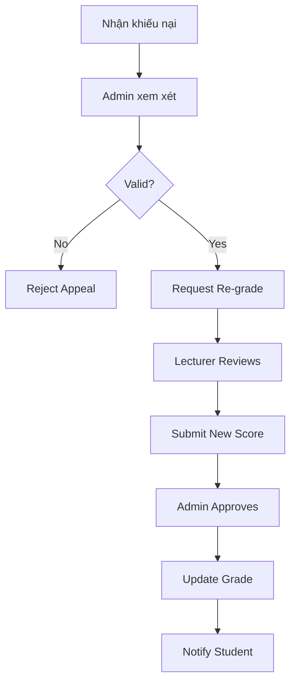

**Timeline:**
- Sinh viên khiếu nại: Trong vòng 7 ngày
- Admin xử lý: Trong vòng 3 ngày
- Giảng viên chấm lại: Trong vòng 5 ngày
- Công bố kết quả: Trong vòng 2 ngày

---

## Phase 7: Lưu trữ và báo cáo

### 7.1 Xuất báo cáo

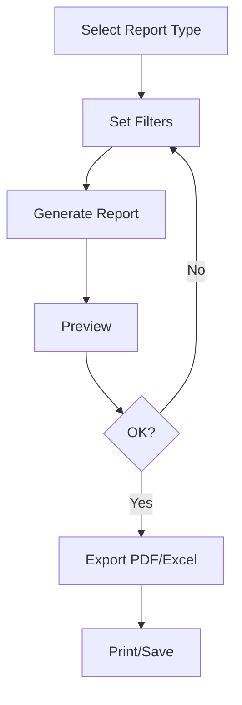

**Available Reports:**
1. Bảng điểm môn thi
2. Thống kê điểm theo lớp
3. Thống kê điểm theo môn
4. Học bạ sinh viên
5. Báo cáo tổng kết kỳ thi

---

### 7.2 Lưu trữ hồ sơ

**Retention Policy:**
| Document | Retention Period |
|----------|------------------|
| Bài thi | 1 năm |
| Bảng điểm | 5 năm |
| Biên bản điểm danh | 1 năm |
| Khiếu nại điểm | 1 năm sau khi xử lý |

---

## API Integration Points

| Endpoint | Phase | Description |
|----------|-------|-------------|
| POST /api/grades | 2.2 | Create grade entry |
| PUT /api/grades/{id} | 2.2 | Update grade |
| POST /api/grades/submit | 3.1 | Submit for approval |
| PUT /api/grades/{id}/approve | 4.2 | Approve grade |
| PUT /api/grades/{id}/publish | 5.2 | Publish grade |
| POST /api/grades/appeal | 6.1 | Submit appeal |
| GET /api/grades/transcript | 7.1 | Generate transcript |

---

## KPIs & Metrics

| Metric | Target | Formula |
|--------|--------|---------|
| Thời gian nhập điểm | < 7 ngày | Days from exam to submission |
| Thời gian duyệt điểm | < 3 ngày | Days from submission to approval |
| Tỷ lệ khiếu nại | < 5% | Appeals / Total grades |
| Tỷ lệ đậu | 80-95% | Passed / Total students |
| Điểm trung bình | 6.0-8.0 | Average score |

---

## Audit Trail

All grade changes are logged:

```json
{
  "gradeId": 123,
  "action": "UPDATE",
  "oldValue": { "score": 7.5, "letterGrade": "B" },
  "newValue": { "score": 8.5, "letterGrade": "A" },
  "changedBy": "lecturer@e360.edu.vn",
  "changedAt": "2024-06-10T14:30:00Z",
  "reason": "Re-grade request"
}
```
